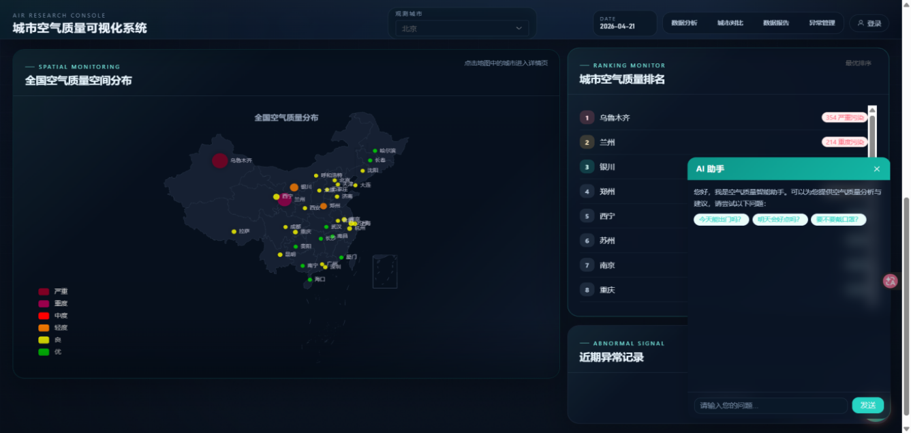
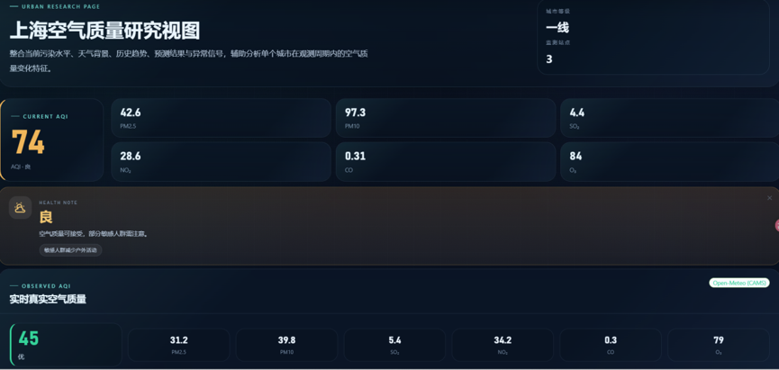
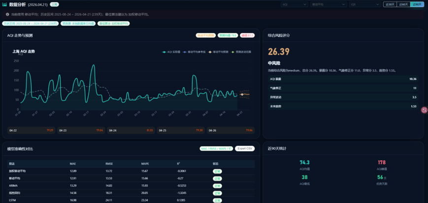
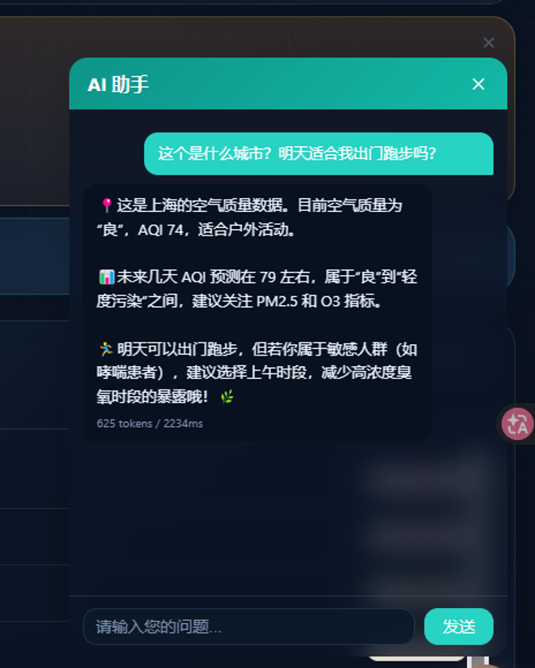
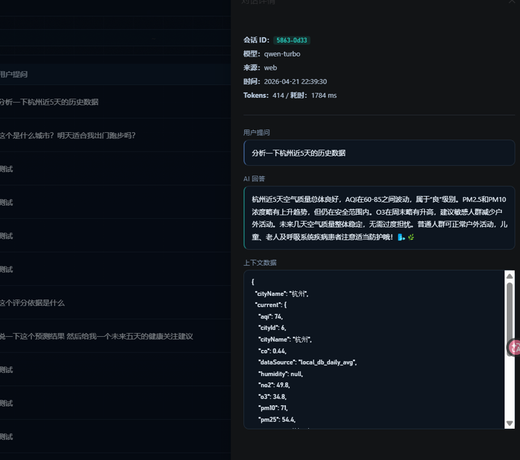
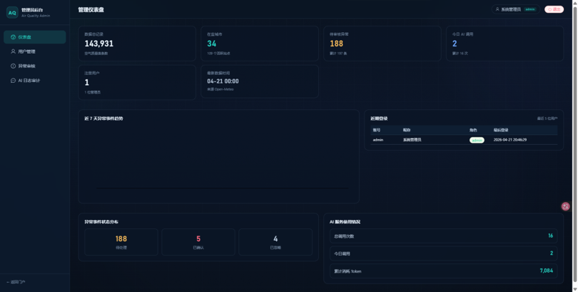
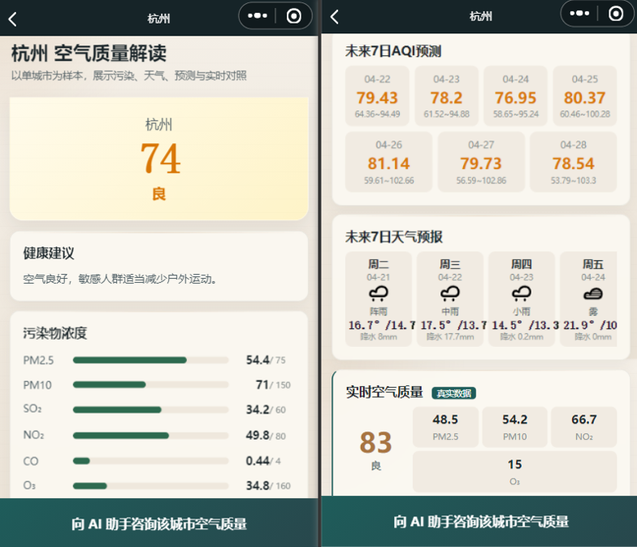

# 城市空气质量数据可视化与趋势预测系统

基于 Vue3 + Flask + 微信小程序的城市空气质量监测、多模型预测与智能风险评估平台。本科毕业设计项目。

## 项目简介

系统覆盖全国 34 个城市的空气质量实时数据采集、多维度可视化、多算法趋势预测、多方法异常检测、综合风险评分，以及 AI 智能问答。提供 Web 端和微信小程序两个客户端入口，附带管理员后台。



## 核心功能

### 数据可视化

- 中国地图热力图、AQI 趋势折线图、雷达图
- 多城市横向对比
- 数据分析报告自动生成



### 多模型趋势预测

支持 6 种预测算法，统一回测窗口对比评估：

| 算法 | 说明 |
|------|------|
| Moving Average (MA) | 简单移动平均，窗口默认 7 天 |
| Weighted Moving Average (WMA) | 加权移动平均，近期权重更高 |
| Linear Regression | 基于 NumPy 的线性回归 |
| Holt-Winters | 二次指数平滑，捕捉趋势与季节性 |
| ARIMA | 自回归积分滑动平均（依赖 statsmodels） |
| LSTM | 长短期记忆网络（依赖 TensorFlow） |

回测指标：MAE / RMSE / MAPE / R²



### 多方法异常检测

| 方法 | 原理 |
|------|------|
| IQR | 四分位距法，阈值 Q1−1.5×IQR ~ Q3+1.5×IQR（Tukey 1977） |
| Z-score | 标准差法，阈值 2.5σ |
| MAD | 改进 Z-score，基于中位数绝对偏差（Iglewicz & Hoaglin 1993） |

支持严重程度三级分类（mild / moderate / severe）和多方法对比。


### 综合风险评分

```
R = R_exposure(0~70) + R_meteo(0~15) + R_anomaly(0~5) + R_trend(0~10)
```

| 分项 | 含义 | 依据 |
|------|------|------|
| R_exposure | AQI 暴露归一化 | HJ 633-2012 |
| R_meteo | 气象静稳/高湿/停滞条件 | QX/T 113-2010、Horton 2014 |
| R_anomaly | 近 60 天异常点密度 | Tukey 1977、Iglewicz 1993 |
| R_trend | 未来 5 天 AQI 预测峰值 | WHO 2021 |

在 143,613 条历史记录上验证：与 HJ 633-2012 分级严格一致率 **96.55%**，±1 级容差一致率 **100%**。

### AI 智能助手

- 接入阿里云通义千问（DashScope），结合实时 AQI、预测数据和异常事件上下文生成分析报告与健康建议
- 支持 Web 端和小程序端对话
- 对话日志审计（token 消耗、响应时间）





### 管理员后台

- 管理仪表盘（系统概览统计）
- 用户管理（CRUD、角色分配）
- 异常事件审核（确认/驳回）
- AI 对话日志审计



### 微信小程序

- 实时空气质量首页
- 城市详情与天气展示（7 日预报 + 污染物浓度条）
- AI 对话功能



## 技术栈

| 层级 | 技术 |
|------|------|
| 前端 Web | Vue 3 + Vite + Pinia + Vue Router + Element Plus + ECharts |
| 前端测试 | Vitest + @vue/test-utils + jsdom |
| 后端 | Flask + SQLAlchemy + Pandas + NumPy + statsmodels + TensorFlow |
| 认证 | JWT (PyJWT) + bcrypt |
| 数据库 | MySQL 8.0 (utf8mb4) |
| AI 服务 | 阿里云 DashScope（通义千问 qwen-turbo / qwen-plus / qwen-max） |
| 小程序 | 微信原生开发 |

## 项目结构

```
city_weather_project/
├── backend/
│   ├── app/
│   │   ├── api/            # RESTful 接口
│   │   │   ├── weather.py          # 天气数据
│   │   │   ├── air_quality.py      # 空气质量
│   │   │   ├── prediction.py       # 趋势预测
│   │   │   ├── anomaly.py          # 异常检测
│   │   │   ├── ai_advice.py        # AI 问答
│   │   │   ├── auth.py             # 登录认证
│   │   │   ├── admin_stats.py      # 管理统计
│   │   │   ├── admin_users.py      # 用户管理
│   │   │   ├── admin_anomaly.py    # 异常审核
│   │   │   └── admin_ai_logs.py    # AI 日志
│   │   ├── models/         # SQLAlchemy 数据模型 (7 张表)
│   │   ├── services/
│   │   │   ├── algorithm.py        # 多模型预测 + 异常检测 + 风险评分
│   │   │   ├── ai_service.py       # 通义千问对话服务
│   │   │   ├── aqi_service.py      # AQI 计算服务
│   │   │   ├── real_aqi_service.py # 实时数据采集
│   │   │   └── weather_service.py  # 天气服务
│   │   └── utils/
│   │       ├── auth.py             # JWT 认证工具
│   │       └── response.py         # 统一响应格式
│   ├── scripts/            # 数据回填与验证脚本
│   ├── sql/init.sql        # 数据库初始化
│   ├── tests/              # 接口 + 认证测试
│   ├── requirements.txt
│   └── run.py
├── frontend/
│   ├── src/
│   │   ├── api/            # Axios 请求封装
│   │   ├── components/     # 图表组件 / AI窗口 / 布局
│   │   ├── views/          # 页面 (看板/分析/城市/对比/异常/报告)
│   │   ├── views/admin/    # 管理后台页面
│   │   ├── layouts/        # AdminLayout
│   │   ├── stores/         # Pinia 状态管理
│   │   └── router/         # 路由 + 权限守卫
│   └── package.json
├── miniapp/                # 微信小程序
│   ├── pages/              # 首页 / 城市详情 / AI 对话
│   └── app.json
└── docs/
    └── 风险评分算法说明.md  # 算法设计文档 + 答辩 QA
```

## 快速开始

### 环境要求

- Node.js 18+
- Python 3.10+
- MySQL 8.0+
- 微信开发者工具（小程序部分）

### 后端

```bash
cd backend

# 安装依赖
pip install -r requirements.txt

# 初始化数据库
mysql -u root -p < sql/init.sql

# 配置环境变量（创建 .env 文件）
# DB_USER=root
# DB_PASSWORD=your_password
# DB_HOST=127.0.0.1
# DB_PORT=3306
# DB_NAME=air_quality_system
# DASHSCOPE_API_KEY=your_key
# SECRET_KEY=your_jwt_secret

# 启动服务
python run.py
```

### 前端

```bash
cd frontend

npm install
npm run dev
```

### 微信小程序

使用微信开发者工具打开 `miniapp/` 目录，配置后端接口地址即可预览。
