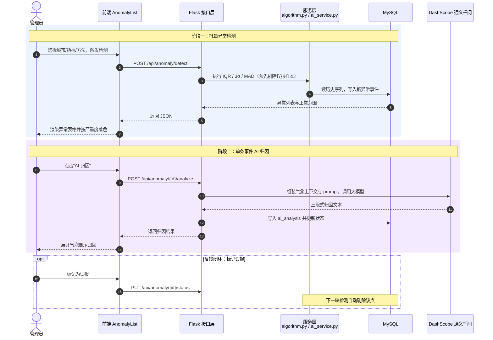
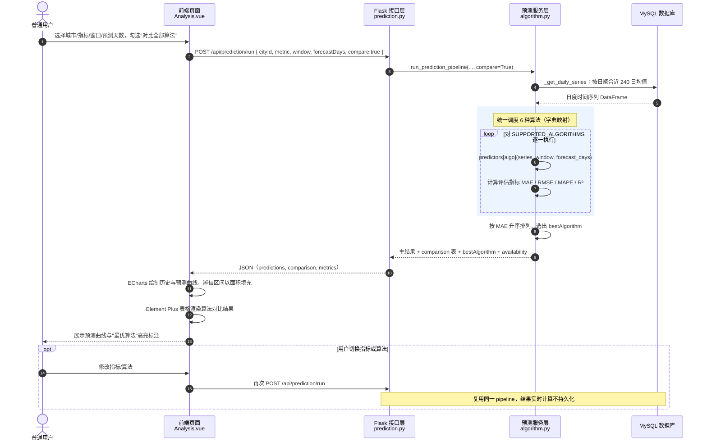
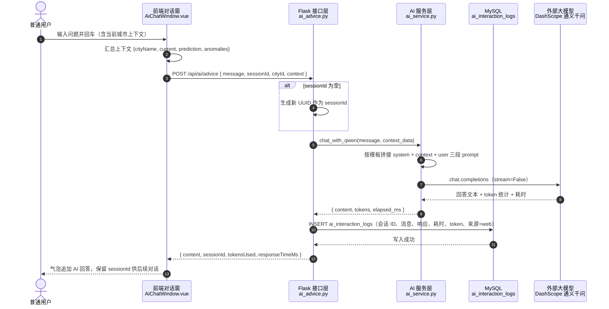
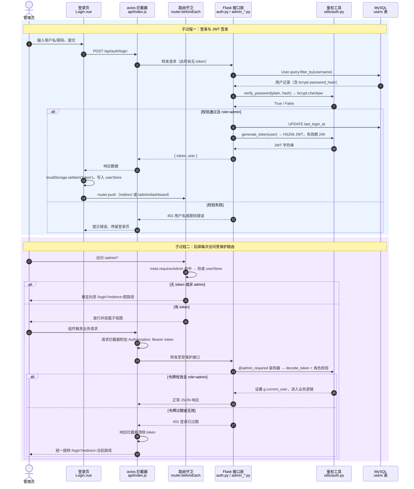
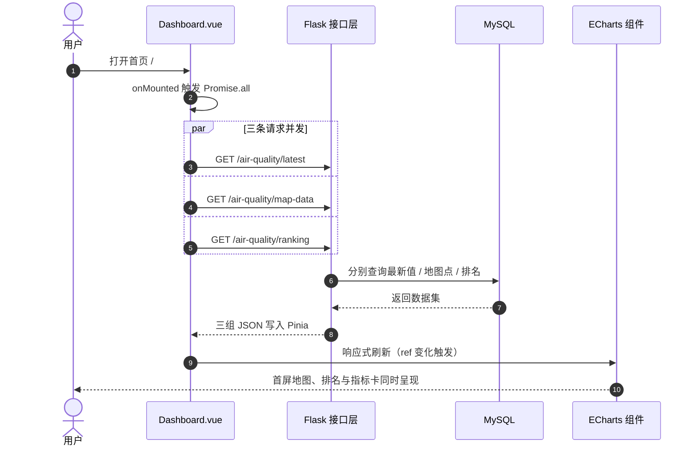

# 《基于 Vue 与 ECharts 的城市空气质量数据可视化系统》

> 完整稿（修订版）—— 已根据系统最新实现修订
> 修订日期：2026-04-18
> 主要修订点：
> 1. 城市数量 20 → 34，记录数 24455 → 143,613
> 2. 综合风险评分模型重构（R = R_exposure 70 + R_meteo 15 + R_anomaly 5 + R_trend 10）
> 3. 风险等级阈值 25/38/58（基于 143,613 条记录标定）
> 4. IQR 引入基于用户反馈的半监督机制
> 5. Z-score 仍在系统中提供（仅不参与风险评分聚合）
> 6. 新增异常归因接口 POST /api/anomaly/<id>/analyze
> 7. 新增 6.3 综合风险评分模型验证实验

---

## 文档使用说明

### 第 6 章实验图表（已生成，位于 docs/figures/）

| 编号 | 文件名 | 说明 |
|---|---|---|
| 图 6-3 | fig_6_3_confusion_matrix.png | 风险评分与 HJ 633 分级混淆矩阵热力图 |
| 图 6-4 | fig_6_4_weight_sensitivity.png | 风险评分权重敏感性分组柱状图 |
| 图 6-5 | fig_6_5_threshold_sensitivity.png | 风险评分阈值敏感性折线图 |
| 图 6-6（AQI） | fig_6_6_model_comparison_aqi.png | AQI 预测模型对比分组柱状图（2×2） |
| 图 6-6（PM2.5） | fig_6_6_model_comparison_pm25.png | PM2.5 预测模型对比分组柱状图（2×2） |

### 需要自己画的图（共 4 张）

| 编号 | 类型 | 内容 |
|---|---|---|
| 图 3-1 | 用例图 | 两个角色 + 约 10 个用例（draw.io / Visio） |
| 图 4-1 | 架构图 | 三层结构（展示层/服务层/数据层） |
| 图 4-2 | 模块图 | 6 个一级模块 + 子功能（树形） |
| 图 4-3 | E-R 图 | 7 个实体 + 关联关系 |

### 时序图（Mermaid 源码已嵌入正文，可直接渲染或导出 PNG）

| 编号 | 类型 | 内容 |
|---|---|---|
| 图 4-4 | 时序图 | 异常检测 + AI 归因闭环 |
| 图 4-5 | 时序图 | 多模型趋势预测与对比评估 |
| 图 4-6 | 时序图 | AI 健康建议对话 |
| 图 4-7 | 时序图 | 管理员登录鉴权与路由守卫 |
| 图 4-8 | 时序图 | 首页数据并发加载与多图渲染 |

### 需要自己截的系统截图（共 11 张）

| 编号 | 内容 |
|---|---|
| 图 5-1 | 首页总览页面 |
| 图 5-2 | 城市详情页面 |
| 图 5-3 | 预测分析页面（上半部分） |
| 图 5-4 | 模型对比表 + 风险评分卡片 |
| 图 5-5 | 城市对比页面 |
| 图 5-6 | 数据报告页面 |
| 图 5-7 | 异常管理页面 |
| 图 5-8 | AI 对话窗口 |
| 图 5-9 | 微信小程序三个页面 |
| 图 5-10 | 相关性热力图 + 季节性箱线图 |
| 图 6-1 | 后端测试运行结果（终端） |
| 图 6-2 | 预测分析页面模型对比表 |

### 需要自己跑实验填的数据

| 位置 | 内容 | 操作方式 |
|---|---|---|
| 表 6-1 | 测试环境配置 | 填你电脑实际配置 |
| 表 6-4 | 模型对比实验结果 | Analysis 页面 → Export CSV |
| 表 6-5~6-8 | 风险评分验证结果 | 已填入参考值，可跑 `backend/scripts/validate_risk.py` 复现 |

---

# 第1章 绪论

## 1.1 研究背景与意义

空气质量与居民日常生活、城市环境治理和公共健康密切相关。随着环境监测体系不断完善，空气质量数据的获取方式逐渐丰富，监测内容也由单一指标扩展为 AQI、PM2.5、PM10、SO₂、NO₂、CO、O₃ 等多项污染物指标，并逐步结合温度、湿度、风速等相关气象信息进行综合分析[1]。在这种背景下，空气质量数据已呈现出数据量大、时间连续性强、指标维度多等特点，传统的表格展示或静态报表方式已难以满足用户快速理解数据的需求。

近年来，数据可视化技术在环境数据展示中的应用不断增多。相关研究表明，将监测数据通过地图、折线图、柱状图、雷达图等方式进行展示，能够更直观地反映空气质量的空间分布特征、时间变化趋势以及不同城市之间的差异[2]。与此同时，随着前后端分离架构和 Web 可视化技术的发展，构建面向城市空气质量场景的交互式数据可视化系统已具备较好的技术条件。

在系统构建层面，现有空气质量可视化研究多聚焦于单一图表展示或局部分析功能，较少将多模型预测、异常识别、风险评估和智能问答整合至同一系统中进行协同分析。本文在借鉴已有可视化方法的基础上，尝试将多种预测算法的并行对比评估、多维度综合风险评分以及大语言模型辅助解释机制融入同一 Web 系统，以在功能完整性与辅助分析能力方面形成一定的特色。

基于上述背景，本文以"基于 Vue 与 ECharts 的城市空气质量数据可视化系统"为研究对象，围绕城市空气质量数据展示、趋势分析和辅助判断需求，设计并实现一个集空气质量总览、城市详情分析、城市对比、数据报告、趋势预测、异常检测和智能问答于一体的 Web 系统。

## 1.2 国内外研究现状

在空气质量监测与数据可视化方面，国内外已经开展了较多研究。周志光等针对空气质量监测数据的时空多维属性，提出了面向空气质量监测数据的可视分析方法，为多维环境数据展示提供了较好的研究基础[1]。田东等进一步面向空气质量细粒度数据，构建了内联关系可视分析系统，在数据关系表达和交互分析方面进行了较深入的探索[2]。

除基础可视化展示外，一些研究还尝试将分析结果直接融入可视化系统中。杨璐等提出基于 ConvGRU 的空气污染预测可视分析系统，将预测结果与可视化展示相结合，使系统不仅能够展示已有数据，还能够反映未来变化趋势[3]。这说明空气质量可视化研究正在由传统图表展示逐渐向交互式综合分析方向发展。

在空气质量预测方法方面，国内外研究者已将统计学习、时间序列分析和深度学习等多种方法应用于空气质量预测任务。。Hyndman 和 Athanasopoulos 在其预测理论专著中系统整理了指数平滑家族（含 Holt-Winters）的递推公式与适用条件[13]->[4]。Li 等将长短期记忆网络（LSTM）应用于空气污染物浓度预测，通过门控机制捕获长期时序依赖特征，取得了优于传统统计模型的效果[15]->[5]；Freeman 等则系统综述了深度学习在空气质量时间序列预测中的应用[16]->[6]。

在异常检测方面，Pang 等对深度异常检测方法进行了全面综述，归纳了基于统计阈值、距离、密度和深度学习等多类方法的适用场景与局限[4]->[7]。基于统计的四分位距（IQR）方法与中位数绝对偏差（MAD）方法因实现简单、抗噪能力较强，在环境数据异常识别中仍具有较高的工程实用性。

在大语言模型辅助分析方面，Vaswani 等提出的 Transformer 架构成为近年来大规模预训练语言模型的基础[5]->[8]。相关研究表明，将结构化分析结果与大语言模型结合，能够有效提升数据解释的可读性与交互自然度。

总体来看，现有研究为空气质量数据展示提供了较好的理论和技术支撑，但仍存在一些不足。部分研究更偏重可视分析方法本身，对完整 Web 系统的页面组织、前后端协同和业务流程描述相对较少；部分系统更强调局部分析功能，而对城市总览、城市详情、城市对比和数据报告等完整功能整合不够充分。因此，如何在一个完整的 Web 系统中整合城市空气质量的多维展示、多模型预测对比、多方法异常识别和智能辅助解释等功能，使用户既能够快速了解数据整体态势，又能够获得具有针对性的分析结论，仍是一个值得探索的方向。本文的研究正是在这一背景下展开。

## 1.3 主要研究内容

本文主要研究内容有三个方面：一是研究城市空气质量数据的组织、管理与可视化展示；二是研究空气质量趋势预测与异常检测的辅助分析方法；三是研究基于 Vue 与 ECharts 的城市空气质量数据可视化系统的设计与实现。

**（1）城市空气质量数据的组织、管理与可视化展示**

本文围绕城市空气质量应用场景，对城市基础信息、监测站点信息、空气质量历史记录以及相关气象数据进行整理和管理。系统以 AQI、PM2.5、PM10、SO₂、NO₂、CO、O₃ 等指标为主要分析对象，对 34 个主要城市的空气质量数据进行统一存储，累计管理约 143,613 条日均记录，并按城市维度和时间维度完成查询、统计与展示。在此基础上，结合中国地图、折线图、柱状图、雷达图和表格等可视化方式，实现全国城市空气质量分布展示、单个城市历史变化展示以及多城市之间的对比展示。通过城市总览、城市详情、城市对比和数据报告等页面，逐步实现从整体到局部、从单城市到多城市的数据展示过程，为系统的预测分析和风险评估功能提供数据基础。

**（2）空气质量趋势预测与异常检测的辅助分析方法**

本文结合空气质量时间序列数据，实现对城市空气质量变化趋势的初步预测，并对异常波动情况进行识别。趋势预测方面，系统采用移动平均、加权移动平均、线性回归、Holt-Winters、ARIMA 和 LSTM 共 6 种方法，对 AQI 及部分主要污染物未来若干天的变化情况进行预测，并在页面中展示预测结果、预测区间和算法对比信息。异常检测方面，系统采用 IQR、Z-score 和 MAD 三种方法，对历史空气质量数据中的异常点进行识别，并生成异常事件列表，辅助用户发现空气质量波动较大的时间段。此外，系统为 IQR 方法引入了基于用户反馈的半监督机制：用户标记为误报的样本会在下次检测的分位数估计中被剔除，形成从用户反馈到检测质量的反馈闭环。上述功能主要作为系统的辅助分析模块，用于提高用户对数据变化趋势和异常情况的理解能力。

**（3）基于 Vue 与 ECharts 的城市空气质量数据可视化系统的设计与实现**

本文设计并实现了一套基于 Vue 与 ECharts 的城市空气质量数据可视化系统。前端采用 Vue 3、ECharts、Element Plus 和 Pinia 实现页面开发与交互设计，后端采用 Flask 框架构建 RESTful API，并通过 MySQL 完成数据存储与管理。系统实现了城市空气质量总览、城市详情分析、城市对比分析、数据报告展示、趋势预测、异常检测和智能问答等功能，同时结合天气数据和风险提示信息，对空气质量数据进行辅助说明。通过前后端联调、接口开发和功能测试，最终形成一个能够满足城市空气质量数据展示与基础分析需求的 Web 系统。

**本文的主要特色体现在以下三个方面：**

第一，在预测分析环节采用多模型并行对比评估方式，将移动平均、加权移动平均、线性回归、Holt-Winters、ARIMA 和 LSTM 六种算法统一调度并通过 MAE、RMSE、MAPE 和 R² 四项指标横向比较，用户可根据不同城市的数据特征灵活选择预测方法，而非依赖单一固定模型。

第二，在风险评估环节设计了融合当前污染暴露、气象扩散条件、异常波动和未来趋势的四维综合风险评分模型。各分项系数均对应 HJ 633-2012[6]、QX/T 113-2010[7]、WHO 2021[8] 等权威标准或文献；模型在 34 个城市共 143,613 条历史记录上完成验证，风险等级划分与国标 HJ 633-2012 分级的严格一致率达 96.55%，±1 级容差一致率 100%，并通过权重敏感性和阈值敏感性分析证明了稳定性。

第三，在智能辅助分析环节引入大语言模型作为解释层，通过将预测结果、风险评分和异常事件等结构化信息作为上下文注入模型，使生成的健康建议能够紧扣当前数据特征。同时，为确认的异常事件自动生成三段式归因分析（可能成因、健康影响、处置建议），辅助用户理解异常成因。

## 1.4 论文组织结构

本论文由七个核心章节构成，依次为：绪论、相关技术与理论基础、系统需求分析、系统设计、系统实现、系统测试与结果分析、总结与展望。

第一章为绪论部分，主要叙述本课题的研究背景与意义，概述国内外在空气质量监测与数据可视化、空气质量预测、异常检测与辅助分析等方面的研究现状，并说明本文的主要研究内容和论文整体结构。

第二章为相关技术与理论基础部分，主要介绍本系统开发过程中涉及的前端开发技术、后端开发技术、数据库技术以及时间序列预测方法、异常检测与风险评估方法和大语言模型相关技术，为后续系统设计与实现提供理论和技术基础。

第三章为系统需求分析部分，主要对城市空气质量数据可视化系统的建设目标进行说明，通过用例分析、关键用例描述与核心业务流程图阐明系统业务，并从功能需求和非功能需求两个方面展开分析，明确系统应具备的主要功能及运行要求。

第四章为系统设计部分，主要包括系统总体架构设计、功能模块设计、算法设计、数据库设计以及接口设计等内容，对系统的整体结构和各模块之间的关系进行规划，为后续开发实现提供设计依据。

第五章为系统实现部分，详细叙述系统各功能模块的具体实现过程，包括后端数据管理与接口实现、前端页面功能实现，以及空气质量数据预处理、趋势预测、异常检测和 AI 辅助分析等核心功能的实现细节。

第六章为系统测试与结果分析部分，主要对系统的功能模块、接口调用和运行效果进行测试与验证，并结合预测模型对比实验和综合风险评分模型验证实验进行分析，以说明系统的可用性和实际运行效果。

第七章为总结与展望部分，主要对本文完成的工作进行归纳总结，分析系统目前存在的不足，并对后续可以进一步完善和扩展的方向进行展望。

---

# 第2章 相关技术与理论基础

## 2.1 系统开发相关技术

### 2.1.1 Vue 3 前端框架

Vue 是一种渐进式 JavaScript 前端框架，具有组件化开发、响应式数据绑定和较低学习成本等特点，适合中小型到中大型 Web 应用开发[9]。本系统前端采用 Vue 3 作为核心开发框架，主要原因在于其组件化思想能够有效提高页面模块的复用性和维护性，同时 Composition API 在逻辑组织上更清晰，便于对空气质量地图、趋势图、统计面板等功能进行拆分和组合。

在城市空气质量数据可视化系统中，前端页面往往包含多种交互式图表、筛选条件和动态数据展示区域。Vue 3 的响应式机制可以在城市切换、指标切换和时间范围变化时，及时驱动页面重新渲染，从而保证用户所见数据与当前选择条件一致。此外，Vue 生态较为完善，能够与 ECharts、Element Plus 等第三方库方便集成，适合作为本系统的界面开发基础。

### 2.1.2 Flask 后端框架

Flask 是基于 Python 的轻量级 Web 框架，具有结构灵活、扩展性较强、开发效率较高等特点[10]。与大型全栈框架相比，Flask 不对项目结构作过多限制，开发者可以根据业务需求灵活组织路由、服务层和数据访问逻辑，因此非常适合用于构建接口型后端服务。

本系统后端需要完成空气质量数据查询、历史数据分析、预测结果计算、异常检测处理和 AI 建议生成等任务。Flask 在实现 RESTful 风格接口方面较为简洁，能够快速完成城市信息、空气质量历史、预测分析、异常管理等 API 的组织与调用。同时，Python 在数据分析和机器学习领域拥有较为成熟的生态，便于将 NumPy、Pandas 以及时序预测相关算法整合到后端业务中。

### 2.1.3 MySQL 数据库

MySQL 是应用广泛的关系型数据库管理系统，具有开源、稳定、易维护和支持 SQL 标准查询等优点[11]。对于空气质量系统而言，城市信息、监测站点信息、空气质量记录、预测结果、异常事件和 AI 分析记录等数据之间存在较明确的结构关系，采用关系型数据库能够方便地实现数据存储、条件筛选和统计查询。

本系统使用 MySQL 存储多类业务数据。一方面，MySQL 可以通过多表关联实现城市、站点与空气质量记录之间的映射；另一方面，利用聚合查询可以方便实现城市平均 AQI、历史趋势数据和异常事件统计等功能。相比纯文件存储方式，关系型数据库在数据一致性、查询效率以及后续维护方面更具优势。

### 2.1.4 ECharts 数据可视化技术

ECharts 是百度开源的数据可视化图表库，支持折线图、柱状图、饼图、散点图、地图、热力图等多种图形形式，并具有易用性强、性能优越、功能多样等特点[12]。对于空气质量数据分析系统而言，数据可视化不仅需要展示数值本身，更需要帮助用户从空间分布、时间变化和指标对比等角度理解数据特征。

本系统采用 ECharts 实现全国城市 AQI 地图、空气质量趋势图、城市对比图、月均变化图和相关性分析图等内容。与普通静态图形相比，ECharts 具有动态更新和交互联动的优势，能够在城市切换、指标切换和时间范围变化时快速刷新图表结果，提高系统的可读性和交互体验。由于本论文题目强调"基于 Vue 与 ECharts 的城市空气质量数据可视化系统"，因此 ECharts 不仅是技术选型的一部分，也是系统展示能力的重要支撑。

## 2.2 数据分析与预测相关方法

考虑到不同预测算法在不同数据分布下的表现存在差异，本系统在预测模块的设计中并未固定采用单一方法，而是引入多种经典时序预测算法进行并行对比。以下依次介绍系统中涉及的主要预测方法及其评价指标。

### 2.2.1 移动平均与 Holt-Winters 方法

移动平均方法是一类经典时间序列平滑与预测方法，其基本思想是利用最近一段时间内的数据平均值作为未来趋势的估计[13]。该方法实现简单、计算成本低，适合处理短期波动较明显但趋势相对平稳的数据。对于空气质量序列而言，移动平均能够在一定程度上削弱偶然波动，反映整体变化趋势。

Holt-Winters 方法则是在指数平滑思想基础上发展而来，通过对水平项、趋势项以及季节项进行递推更新，实现对时间序列的短期预测[13]。相比普通移动平均方法，Holt-Winters 在处理具有趋势变化的数据时更具优势。

本系统中，移动平均和 Holt-Winters 方法作为较轻量、实现成本较低的时序预测方法，被用于空气质量趋势预测模块。它们不仅具有较好的工程可实现性，也适合作为与 ARIMA、LSTM 等模型进行误差比较的基线方法。

### 2.2.2 ARIMA 时序预测模型

ARIMA（AutoRegressive Integrated Moving Average，自回归积分滑动平均模型）是时间序列预测中的经典方法。其基本思想是通过自回归项、差分项和移动平均项共同描述时间序列的变化规律。ARIMA 对平稳时间序列具有较好的建模能力，在经济、气象和环境监测等领域得到了广泛应用。罗娜等将 ARIMA 与 GRU 组合用于 PM2.5 浓度预测，表明该类方法在空气质量短期预测场景中具有良好适用性[14]。

在空气质量数据中，AQI 和部分污染物浓度通常具有一定的连续性和时间相关性，因此可以使用 ARIMA 模型进行短期预测。相较于简单平滑方法，ARIMA 能够更系统地利用历史序列中的相关结构信息。但其建模效果也受到样本规模、参数选择和数据稳定性的影响。本系统引入 ARIMA 模型，主要目的是提高趋势预测的表达深度，并为后续模型对比实验提供更具代表性的传统时序分析方法。

### 2.2.3 LSTM 预测模型

LSTM（Long Short-Term Memory，长短期记忆网络）是循环神经网络的一种改进结构，通过输入门、遗忘门和输出门机制缓解了传统循环神经网络在长序列学习中存在的梯度消失问题，因此在时间序列预测中具有较好的表现。Li 等将 LSTM 应用于空气污染物浓度预测，取得了优于传统统计模型的效果[15]；Freeman 等进一步对深度学习在空气质量时间序列预测中的应用进行了系统综述[16]。

空气质量数据通常具有一定的非线性变化特征，且受多种因素共同影响。相比传统统计模型，LSTM 在捕捉复杂时序关系方面具有一定优势。本系统引入 LSTM 模型，主要用于与传统方法进行比较分析，以探讨不同预测模型在城市空气质量数据场景下的适用性。

需要指出的是，复杂模型并不一定在所有数据场景下都优于简单模型。实际效果还取决于样本规模、数据波动特征及参数设置。因此，本系统并未简单将 LSTM 作为唯一预测方案，而是通过多模型并行评估的方式，选择更适合当前数据特点的方法。

### 2.2.4 MAE、RMSE、MAPE 与 R² 评价指标

为了比较不同预测模型在空气质量数据上的表现，本文采用 MAE、RMSE、MAPE 和 R² 作为模型评价指标[17]。

MAE（Mean Absolute Error，平均绝对误差）表示预测值与真实值偏差绝对值的平均水平，计算简单，能够直观反映平均预测误差。RMSE（Root Mean Square Error，均方根误差）对较大的预测误差更敏感，因此在评价模型稳定性时较有参考价值。MAPE（Mean Absolute Percentage Error，平均绝对百分比误差）表示误差占真实值的相对比例，便于不同量纲和尺度的数据之间进行比较。R²（决定系数）则用于评价模型对数据变化的解释能力，取值越接近 1，说明拟合效果越好。

在本系统中，这些指标被用于对移动平均、加权移动平均、线性回归、Holt-Winters、ARIMA 和 LSTM 六种模型进行横向比较，并支持将对比结果导出，用于实验结果分析与模型适用性讨论。

## 2.3 异常检测与风险评估方法

### 2.3.1 IQR、Z-score 与 MAD 异常检测方法

异常检测是空气质量数据分析中的重要环节，其目的在于识别偏离常规波动区间的异常点，从而为预警分析和风险判断提供依据。常见的统计异常检测方法包括 IQR、Z-score 和 MAD。

IQR（Interquartile Range，四分位距）方法是基于分位数的典型稳健异常检测方法[4]。设第一四分位数为 Q₁，第三四分位数为 Q₃，则四分位距为：

$$IQR = Q_3 - Q_1$$

通常将区间 [Q₁ - 1.5·IQR, Q₃ + 1.5·IQR] 视为正常范围，超出该范围的数据视为异常值。考虑到 AQI 及各污染物浓度均为非负变量，本文在系统实现中对下界加入非负约束，即当下界小于 0 时取 0，以保证结果更符合环境数据实际含义。

Z-score 方法通过均值与标准差描述数据分布特征，若某点偏离均值程度较大，则可视为异常[4]。MAD（Median Absolute Deviation，中位数绝对偏差）方法则以中位数为中心，具有更强的抗极端值干扰能力[4]。

本系统综合采用 IQR、Z-score 与 MAD 三种方法，在异常管理模块中对用户开放选择和对比。需要说明的是，在综合风险评分模型的聚合计算中（详见 2.3.2 节），系统仅使用 IQR 和 MAD 两种方法的检出结果。其原因在于 Z-score 基于均值和标准差，而这两个统计量本身会被异常值扭曲，在聚合场景下与 IQR 的检测目标高度重叠、容易产生重复计数；IQR 基于分位数、MAD 基于中位数，两者互补且均具有较强的稳健性，更适合作为风险评分的输入。

此外，为进一步提高异常检测的稳健性，本系统为 IQR 方法引入了基于用户反馈的半监督机制：当用户将某个异常点标记为误报（dismissed）时，该日期会从下一次 IQR 检测的分位数估计中被自动剔除，避免已知误报的样本继续扭曲 Q₁、Q₃ 和 IQR 的计算结果。这种机制使检测阈值随用户反馈逐步收敛，形成从用户标注到检测质量的反馈闭环。

### 2.3.2 综合风险评分方法

单纯依靠 AQI 或单个污染物指标难以全面反映空气质量风险，因此本文针对空气质量多因素叠加的特点，设计了一种面向系统分析的综合风险评分方法。该方法的设计原则是：每一项权重、阈值、系数都对应到一份可引用的国家标准或权威文献，对于不可避免的工程经验成分，采用全量历史数据进行验证。

**模型总公式：**

R = R_exposure + R_meteo + R_anomaly + R_trend,R∈ [0,100]

各分项设计依据如下：

**（1）暴露分 R_exposure（0 ~ 70）**

$$R_{exposure} = \min\left(70,\ \frac{AQI}{500} \times 70\right)$$

AQI 按环境保护部发布的 HJ 633-2012《环境空气质量指数（AQI）技术规定（试行）》[6]计算：对 PM2.5、PM10、SO₂、NO₂、O₃、CO 六项污染物各自求得分指数 IAQI，取最大值作为综合 AQI。因此暴露分中污染物之间如何权衡由国家标准决定，不再引入额外的人工权重。归一化分母 500 对应 AQI 的国标上限（严重污染上限），使暴露分与 AQI 本身严格线性等价，无信息损失。

**（2）气象修正分 R_meteo（0 ~ 15）**

$$R_{meteo} = \min(15,\ f_{wind} + f_{humidity} + f_{stagnation})$$

| 子项 | 判据 | 得分 | 出处 |
|:--|:--|:--:|:--|
| f_wind | 风速 ≤ 3 m/s | 8 | QX/T 113-2010[7] |
| f_humidity | 相对湿度 ≥ 80% | 4 | QX/T 113-2010[7] |
| f_stagnation | 风速 ≤ 3.2 m/s 且日降雨 < 1 mm | 3 | Horton 2014[18] |

3 m/s 与 80% 是气象行业标准 QX/T 113-2010《霾的观测和预报等级》原文给出的静稳与高湿判据；3.2 m/s 是 Horton 等 2014 年发表于 Nature Climate Change 的全球大气停滞指数（Air Stagnation Index）阈值。三项分值按 8 : 4 : 3 分配，体现风速对颗粒物累积的主导影响。

**（3）异常波动分 R_anomaly（0 ~ 5）**

$$R_{anomaly} = \min(5,\ 0.5 \times (n_{iqr} + n_{mad}))$$

其中 n_iqr、n_mad 分别为近 60 天内用 IQR 法和 MAD 法检出的异常点数。此处仅聚合 IQR 与 MAD 两种稳健方法的检出结果，未引入 Z-score。原因是 Z-score 基于均值与标准差，本身易受极端值影响；在聚合求和的场景下与 IQR 的检测目标高度重叠，容易对同一批样本进行重复计数，因此不纳入聚合。

**（4）未来趋势分 R_trend（0 ~ 10）**

$$R_{trend} = \min\left(10,\ \frac{\max_{t=1\cdots 5}\ AQI_t}{500} \times 10\right)$$

其中 AQI_t 为 Holt-Winters 二次指数平滑法预测的未来第 t 天 AQI。采用峰值而非均值，依据 WHO《全球空气质量指南（2021）》[8]关于短期暴露的健康风险评估"应重点关注高浓度时段"的建议。若使用均值，"4 天良 + 1 天重污染"与"5 天连续轻度污染"可能评出相近分数，但前者健康风险显著更高。

**风险等级划分：**

风险等级按总分 R 划分为四级：低（R < 25）、中（25 ≤ R < 38）、高（38 ≤ R < 58）、严重（R ≥ 58）。阈值组 25 / 38 / 58 是在 34 个城市共 143,613 条真实历史记录上，以"与 HJ 633-2012 国标分级的一致率"为目标函数，通过网格搜索标定得到的结果。验证实验详见第 6 章第 6.3 节。

这种风险评分方法并不等同于环境管理部门发布的官方指数，而是面向系统分析与辅助决策的内部评价方法。其主要目的在于增强系统对空气质量变化趋势的解释能力，并为 AI 健康建议生成提供输入依据。与单一阈值判别相比，综合风险评分能够更好体现多因素共同作用下的空气质量变化特点。

## 2.4 大模型辅助分析技术

大语言模型（Large Language Model, LLM）是近年来人工智能领域的重要发展方向，其核心思想是通过大规模语料训练获得较强的语言理解与生成能力。当前主流大语言模型通常建立在 Transformer 架构[5]基础上，能够较好处理自然语言中的上下文依赖关系。

在空气质量分析场景中，大语言模型作为解释层与交互层工具，即在已有结构化数据、预测结果和风险评估基础上，利用大语言模型将复杂数值结果转化为更易理解的文字结论，生成面向普通用户的健康建议，从而提升系统的人机交互能力。

与直接将用户问题提交给大语言模型的做法不同，本系统在每次调用前均通过结构化上下文注入机制，将当前城市的空气质量数据、多模型预测结果、综合风险评分和近期异常事件等信息序列化为上下文文本，与用户提问一并传递给模型。这种方式使大语言模型的输出能够紧密结合当前数据特征，避免生成脱离实际数据的泛化回复，在增强系统可解释性的同时提升了智能辅助分析的实用价值。

## 2.5 本章小结

本章介绍了系统开发所需的技术与理论基础。技术层面，介绍了 Vue 3、Flask、MySQL 和 ECharts 四项核心技术；方法层面，介绍了移动平均、Holt-Winters、ARIMA 和 LSTM 四类预测方法及 MAE、RMSE、MAPE、R² 四项评价指标；在异常检测与风险评估方面，介绍了 IQR、Z-score 和 MAD 三种异常检测方法以及本文设计的四维综合风险评分模型；最后介绍了大语言模型在空气质量分析场景中作为解释层的应用思路。上述内容为后续系统设计与实现提供了理论和技术基础。

---

# 第3章 系统需求分析

在系统开发之前，需要对系统的业务背景、用户需求和技术约束进行分析。本章从业务需求、功能需求和非功能需求三个方面，明确系统应具备的能力和应满足的条件，为后续的系统设计和实现提供依据。

## 3.1 业务需求分析

随着公众对空气质量关注度的持续提升，城市空气质量数据的获取渠道不断增多，但数据形式大多以数值表格或简单指数为主，缺少直观的可视化展示手段。对于普通用户而言，仅凭 AQI 数值难以全面理解不同城市、不同时段的空气质量差异，也不易判断未来空气质量的变化趋势。对于研究人员和管理者，则需要更系统的分析工具来辅助比较和决策。

基于上述背景，本系统的业务需求可以概括为以下几个方面：

（1）数据展示与概览需求。系统应当以可视化方式呈现多个城市的空气质量状况，包括全国范围的空间分布、单个城市的时间变化趋势和各项污染物指标的对比信息。展示形式应尽可能直观，便于用户快速了解整体态势。

（2）预测分析与模型评估需求。系统应当提供空气质量趋势预测功能，并支持多种预测算法的对比分析。用户不仅需要看到预测结果，还需要了解不同算法的误差水平，以便判断预测结果的可参考程度。

（3）异常检测与风险评估需求。空气质量数据中可能出现偏离正常范围的异常波动，系统应当具备自动检测异常的能力，并能对当前空气质量风险进行综合评估，为用户提供辅助判断。同时，系统应当支持用户对误报异常事件进行标记，并在后续检测中自动剔除已标记的样本，以持续提高检测质量，形成反馈闭环。

（4）智能辅助分析需求。对于非专业用户而言，空气质量数据和分析结果的专业性可能形成理解门槛。系统应当利用大语言模型将结构化的分析结果转化为自然语言建议，帮助普通用户理解当前空气质量状况和应对措施。

（5）多端访问需求。不同使用场景对访问方式有不同要求。系统除提供 Web 端完整功能外，还应支持移动端的轻量访问，使用户能够随时查看基本的空气质量信息和 AI 建议。

## 3.2 功能需求分析

### 3.2.1 系统用例分析

根据业务需求分析，系统涉及两类角色：普通用户和管理人员。普通用户可以浏览空气质量数据、查看预测结果、生成数据报告以及与 AI 助手对话；管理人员在此基础上还可以执行批量异常检测、对异常事件进行确认或标记为误报，并触发 AI 归因分析。系统用例图如图 3-1 所示。

**【此处插入图 3-1：系统用例图】**

> **用例图绘制说明：** 左侧角色为"普通用户"，右侧角色为"管理人员"（继承普通用户）。普通用户的用例包括：查看全国空气质量概览、查看城市详情数据、查看趋势预测结果、进行城市对比分析、生成数据报告、导出数据、与 AI 助手对话、使用小程序端。管理人员额外的用例包括：执行批量异常检测、生成异常事件归因分析、标记误报事件。

### 3.2.2 关键用例描述

用例图给出了系统的整体功能轮廓，但要让后续设计与实现工作能够对接到具体场景，还需要选取若干代表性用例进行规约化描述。结合本系统的算法主干、管理员审核闭环以及大模型辅助分析三条技术路径，本文从图 3-1 中挑选三条最具代表性的用例——多模型趋势预测与结果对比、异常检测与管理员审核闭环、AI 健康建议对话——分别给出标准用例描述。

**（1）UC-01 多模型趋势预测与结果对比**

**用例编号**：UC-01。**用例名**：多模型趋势预测与结果对比。**参与者**：普通用户。**前置条件**：所选城市在数据库中具有不少于 20 条日均记录；预测分析页面已加载完成。**主要流程**：用户进入预测分析页面后，依次选择目标城市、预测指标（AQI / PM2.5 / PM10 / O₃）、滑动窗口大小和预测天数，并勾选"对比全部算法"开关；前端将参数封装为 JSON 通过 `POST /api/prediction/run` 提交至后端；后端调度函数 `run_prediction_pipeline` 一次性查询历史日均序列，再按字典分派依次执行移动平均、加权移动平均、线性回归、Holt-Winters、ARIMA、LSTM 共 6 种算法，并在测试集上分别计算 MAE、RMSE、MAPE、R² 四项指标，最终按 MAE 升序返回对比结果与最优算法标识；前端用 ECharts 绘制历史与预测曲线，用 Element Plus 表格渲染对比数据并对最优算法行高亮。**扩展流程**：当 ARIMA 或 LSTM 因 statsmodels / TensorFlow 未安装而无法运行时，系统自动回退至移动平均，并在结果中以 `usedFallback` 字段提示；用户切换指标或算法时复用同一 pipeline 实时重算，不写入预测历史表。**后置条件**：预测曲线、置信区间和模型对比表呈现给用户；可一键导出 CSV。

**（2）UC-02 异常检测与管理员审核闭环**

**用例编号**：UC-02。**用例名**：异常检测与管理员审核闭环。**参与者**：管理员（继承自普通用户）。**前置条件**：管理员已通过 `POST /api/auth/login` 登录并取得有效 JWT；目标城市具备不少于 10 条历史日均记录。**主要流程**：管理员进入异常管理页面后，按城市、指标和检测方法发起 `POST /api/anomaly/detect`；后端在执行检测之前先从异常事件表中读取所有 `status='dismissed'` 的样本日期，将其从原始序列中剔除，再基于剩余数据计算分位数与正常范围（IQR 方法），逐点判定并按轻度 / 中度 / 重度三级标注严重度，新事件写入 `anomaly_events` 表；前端表格展示异常列表，管理员针对单条事件可选择"AI 归因"或"标记为误报"。前者触发 `POST /api/anomaly/<id>/analyze`，后端补齐当日气象上下文后请求 DashScope 通义千问，得到三段式归因文本（可能成因、健康影响、处置建议）并写回 `ai_analysis` 字段；后者触发 `PUT /api/anomaly/<id>/status`，将事件状态置为 `dismissed`。**扩展流程**：未登录用户在异常管理页面只能查看列表，写操作按钮被前端隐藏并显示登录提示；归因接口在 LLM 调用失败时返回降级提示，事件状态不变。**后置条件**：异常事件状态在数据库中持久化，审核人和审核时间留痕；被标记为误报的样本在下一轮 IQR 检测中自动剔除，形成由用户反馈驱动检测阈值收敛的闭环。

**（3）UC-03 AI 健康建议对话**

**用例编号**：UC-03。**用例名**：AI 健康建议对话。**参与者**：普通用户。**前置条件**：用户已进入任一业务页面，对话窗口的浮动按钮可见；DashScope API Key 已正确配置。**主要流程**：用户点击浮动按钮展开对话窗，输入问题；前端将当前城市的污染物数据、近 7 天预测结果、近期异常摘要和综合风险评分汇总为 `context` 字段，连同 `message` 与 `sessionId` 一并通过 `POST /api/ai/advice` 提交至后端；后端按 system + context + user 三段式拼装 prompt，调用通义千问的 chat completions 接口取得回答与 token 统计，将本轮请求、响应、耗时与 token 消耗写入 `ai_interaction_logs` 表，最后将文本与 sessionId 返回前端；前端在对话窗中追加 AI 回答气泡，并保留 sessionId 作为下一轮上下文。**扩展流程**：sessionId 为空时由后端生成 UUID 作为新会话起点；context 字段缺失时退化为通用对话，但接口仍照常返回与记录。**后置条件**：对话内容呈现给用户，本轮调用全量信息可在管理员后台 AI 日志审计中按会话 ID 检索。

### 3.2.3 核心业务流程

用例描述刻画了"做什么"，但用例本身不便表达多角色协作下的判断分支与状态流转。本节针对前述 UC-01 与 UC-02 进一步给出业务流程图，借助泳道结构把不同角色和组件之间的执行顺序、判断节点以及反馈回路显式化，作为需求阶段对系统行为的最后一层补充。这两条流程之所以单独成图，是因为它们贯穿了"前端交互 → 后端调度 → 算法执行 → 结果回流"的全链路，最能体现本系统在算法侧的核心工作量。

**【此处插入图 3-2：多模型预测与结果对比流程图】**

> **流程图绘制说明（建议泳道图，4 条横向泳道）：**
> - 泳道 1（用户）：起点节点"开始" → 操作节点"选择城市/指标/窗口/预测天数" → 操作节点"勾选'对比全部算法'开关" → 终点节点"查看预测曲线与对比表"
> - 泳道 2（前端 Analysis.vue）：操作节点"封装请求 JSON" → 操作节点"POST /api/prediction/run" → 操作节点"接收 JSON 响应" → 操作节点"ECharts 绘制曲线 + 表格高亮最优算法"
> - 泳道 3（Flask 接口层 prediction.py）：操作节点"参数校验与日志记录" → 操作节点"调用 run_prediction_pipeline" → 操作节点"包装 JSON 响应"
> - 泳道 4（算法服务层 algorithm.py）：操作节点"_get_daily_series 一次性查询日均序列" → **判断节点"compare = True ?"**（菱形）→ 真分支：进入循环节点"对 6 种算法依次预测并计算评估指标" → 操作节点"按 MAE 升序排序，标识 bestAlgorithm" → 假分支：仅执行用户指定算法 → 合并节点 → 返回主结果与 comparison 表
> - 泳道之间用带箭头的实线表示控制流，泳道内部串接的操作节点用普通箭头连接

图 3-2 把 UC-01 拆解为四条泳道协同的执行序列：用户的交互动作只触及前端，前端不承担任何算法逻辑，仅作为参数装配与图表渲染的薄层；接口层是单一入口，承担参数校验与响应封装；算法服务层则是真正的执行核心，所有算法在同一调度函数下以"相同输入、相同输出结构"的契约运行，避免了重复读库与计算分散。流程中的关键判断节点是 `compare` 开关，它决定算法是单算法直出还是 6 种全跑——这一开关也是模型对比实验在系统层面的入口。

**【此处插入图 3-3：异常检测-管理员审核-误报反馈闭环流程图】**

> **流程图绘制说明（建议泳道图，5 条横向泳道）：**
> - 泳道 1（管理员）：起点节点"开始" → 操作节点"选择城市/指标/方法" → 操作节点"触发批量检测" → **判断节点"对每条事件如何处置 ?"**（菱形）→ 分支 A：选择"AI 归因" → 分支 B：选择"标记为误报"
> - 泳道 2（前端 AnomalyList.vue）：操作节点"POST /api/anomaly/detect" → 操作节点"渲染异常表格" → 分支 A 后：操作节点"POST /api/anomaly/{id}/analyze" → 分支 B 后：操作节点"PUT /api/anomaly/{id}/status"
> - 泳道 3（Flask 接口 anomaly.py）：操作节点"接收检测请求" → 操作节点"调用 algorithm.iqr_detect" → 操作节点"接收归因请求" → 操作节点"组装气象上下文" → 操作节点"调用 ai_service" → 操作节点"接收状态更新请求"
> - 泳道 4（algorithm.py + ai_service.py）：**判断节点"是否存在 status='dismissed' 样本 ?"**（菱形）→ 真分支：操作节点"剔除该日期" → 假分支：直接计算 → 操作节点"计算 Q1/Q3/IQR 与正常范围" → 操作节点"逐点判定异常并分级" → 操作节点"调用 DashScope 生成三段式归因"
> - 泳道 5（MySQL）：操作节点"读 air_quality_records" → 操作节点"读 anomaly_events 中 dismissed 列表" → 操作节点"写入新异常事件" → 操作节点"写回 ai_analysis 字段" → 操作节点"更新 status 为 dismissed"
> - 在分支 B 末端从泳道 5 反向画一条虚线箭头回到泳道 4 的"判断节点'是否存在 dismissed 样本'"，并在箭头上注明"下一轮检测自动剔除"，以表达反馈闭环

图 3-3 在时间轴上显式刻画了"用户标记误报"如何回流到"算法分位数估计"——这条由虚线箭头表达的反馈回路，正是本系统在传统纯统计阈值方法之上引入的半监督机制。流程中还有两个关键判断节点：dismissed 样本是否存在决定 IQR 是否需要做样本筛除；管理员对每条事件的处置选择决定后续是 AI 归因路径还是误报标注路径。两条路径共享同一份事件列表，但对数据库与外部大模型的写入行为完全不同，业务流程图能清晰区分这一点。

### 3.2.4 功能需求描述

根据用例分析，系统的功能需求可划分为以下模块：

**（1）空气质量数据展示模块**

该模块为系统的基础功能，负责将空气质量数据以可视化方式呈现给用户。主要需求包括：以全国地图形式展示各城市 AQI 分布；以指标卡片展示当前城市的 AQI、PM2.5、PM10 等数值；以折线图展示指定时间范围内的 AQI 变化趋势；以雷达图展示六项污染物的浓度结构；展示城市 AQI 排名和气象信息。用户应能通过切换城市和时间范围来更新展示内容。

**（2）预测分析模块**

该模块提供空气质量趋势预测和模型评估功能。主要需求包括：支持选择不同的预测指标（AQI、PM2.5、PM10、O3）和预测算法（移动平均、加权移动平均、线性回归、Holt-Winters、ARIMA、LSTM）；展示预测曲线及置信区间；支持多模型同时运行并以表格形式对比各算法的 MAE、RMSE、MAPE 和 R² 指标；支持将对比结果导出为 CSV 文件。

**（3）异常检测与风险评估模块**

该模块负责识别空气质量数据中的异常波动并评估综合风险。主要需求包括：支持 IQR、Z-score 和 MAD 三种异常检测方法的选择与对比；对检测出的异常事件按轻度、中度和重度进行分级；提供异常事件列表的筛选和管理功能；支持用户为异常事件生成 AI 归因分析或标记为误报；被标记为误报的样本在下一次 IQR 检测中自动剔除；计算综合风险评分并展示各维度得分。

**（4）城市对比与数据报告模块**

该模块满足用户在多个城市之间进行横向比较和生成统计汇总报告的需求。城市对比功能需支持选择 2～4 个城市，展示 AQI 趋势对比、污染物结构对比和数据明细对比。数据报告功能需支持选择不同的统计周期（30 天、90 天、半年、一年），生成包含 AQI 分布、等级占比、月均变化、污染物相关性和季节性分析等内容的统计报告。

**（5）AI 健康建议模块**

该模块利用大语言模型为用户提供基于当前数据的健康建议。主要需求包括：以浮动窗口形式嵌入各页面，提供实时对话功能；在请求时自动注入当前城市的空气质量数据、预测结果和风险评估信息作为上下文；对已标记确认的异常事件自动生成三段式归因分析文本（可能成因、健康影响、处置建议）；对话记录应持久化存储。

**（6）微信小程序模块**

该模块为移动端提供轻量化访问能力。主要需求包括：支持查看城市空气质量概览和六项污染物浓度；展示 AQI 趋势图和天气信息；提供预测结果查看功能；支持与 AI 助手对话，与 Web 端共享同一后端接口。

**（7）权限与管理员后台模块**

在前述 6 个业务模块之外，系统还需要面向运维场景提供一个独立的管理员后台，解决三类问题。其一，异常事件的确认和误报标记会直接影响 IQR 检测的阈值估计，若对匿名用户开放将引入恶意或误点噪声，因此这类写操作必须在身份鉴定之后才可执行；其二，AI 归因分析会触发实际的大模型计费调用，需要对调用来源做审计；其三，数据库已预留的 `users` 表和 `role` 字段需要落地为可验证的账号体系，否则数据库设计与实际功能脱节。综合上述，系统需要提供管理员登录、用户账号管理（增删改查、密码重置）、异常事件批量审核（确认为异常或标记为误报，均记录审核人和审核时间）、管理员仪表盘（展示数据规模、异常处置状态、AI 调用次数等运行指标）以及 AI 对话日志审计五项功能。普通浏览数据和个人端的 AI 对话维持匿名可用，仅与系统数据质量相关的写操作受权限约束。

## 3.3 非功能需求分析

**（1）易用性需求**

系统界面应当布局清晰、操作直观，用户无需专业培训即可完成城市切换、条件筛选、图表查看等基本操作。各页面之间应保持一致的视觉风格和交互方式。图表应具备 tooltip 提示和缩放等交互能力，提高数据阅读效率。

**（2）性能需求**

页面加载时间应控制在合理范围内。空气质量数据查询接口在数据量为十万条量级时应能在 2 秒内返回结果。预测算法的执行时间应在用户可接受的等待范围内，对于计算较慢的算法（如 ARIMA、LSTM），前端应提供加载状态提示。当某一算法因依赖缺失无法运行时，系统应自动回退到可用的替代方法，确保功能不中断。

**（3）可扩展性需求**

系统在架构设计上应便于后续扩展。后端接口采用 RESTful 风格，前端通过统一的 API 模块调用接口，降低前后端的耦合度。预测算法以字典映射方式注册，新增算法只需实现统一的接口规范即可接入系统。数据库表结构应预留适当的扩展空间。

**（4）安全性需求**

面向运维的写操作接口（异常确认、误报标记、AI 归因分析触发、用户管理等）不应对匿名访问开放，需通过身份鉴定之后才能执行。用户密码禁止以明文存储，必须使用带盐的单向哈希算法入库。接口鉴权机制应符合前后端分离架构的无状态要求，避免依赖服务端会话；同时应提供令牌过期机制，降低令牌泄露后造成的持续风险。涉及审核类动作的数据修改应留痕，记录操作者与操作时间，为后续审计提供依据。

## 3.4 本章小结

本章从业务需求、功能需求和非功能需求三个层面对系统进行了分析。业务需求方面，系统需要满足数据展示、预测分析、异常检测、智能建议和多端访问五方面需求。功能需求方面，先通过用例图、3 条关键用例的规约化描述以及 2 张核心业务流程图阐明系统行为，再将系统划分为空气质量展示、预测分析、异常检测与风险评估、城市对比与报告、AI 健康建议、微信小程序和权限与管理员后台共 7 个功能模块。非功能需求方面，系统在易用性、性能、可扩展性和安全性上提出了具体要求。上述分析为第 4 章的系统设计提供了依据。

---

# 第4章 系统设计

在需求分析的基础上，本章对系统的总体架构、功能模块、算法方案、数据库结构和接口进行设计。

## 4.1 系统架构设计

本系统采用前后端分离的 B/S（Browser/Server）架构，整体分为前端展示层、后端服务层和数据存储层三部分。系统总体架构如图 4-1 所示。

**【此处插入图 4-1：系统总体架构图】**

> **架构图绘制说明：** 三层结构，自上而下排列。
> - 展示层（顶部）：左侧为 Web 前端（Vue 3 + ECharts + Element Plus），右侧为微信小程序端，两端均通过 HTTP 请求访问后端接口。
> - 服务层（中间）：Flask 后端，内部包含 API 路由层、业务服务层（预测服务、异常检测服务、风险评估服务、AI 服务、天气服务、AQI 数据服务）。外部对接两个第三方服务：Open-Meteo API（气象与 AQI 数据）和 DashScope API（通义千问大模型）。
> - 数据层（底部）：MySQL 数据库，包含 7 张业务数据表。

前端展示层负责页面渲染、用户交互和图表绑定。Vue 3 框架提供组件化开发能力和响应式数据绑定，ECharts 负责地图、折线图、雷达图等可视化图表的生成，Element Plus 提供表格、表单、对话框等界面基础组件，Pinia 作为状态管理工具在各组件间共享城市列表、空气质量数据等全局状态。前端通过 Vite 开发服务器的代理配置将 `/api` 路径的请求转发至后端。

后端服务层采用 Flask 框架，以蓝图（Blueprint）方式组织路由模块。API 路由层接收前端请求并调用对应的业务服务；业务服务层实现预测计算、异常检测、风险评分、AI 对话等核心逻辑。后端在启动时自动检测数据库中的数据缺口，通过 Open-Meteo 接口补充缺失数据，确保系统数据的时效性。

数据存储层使用 MySQL 关系型数据库，通过 SQLAlchemy ORM 完成数据访问操作。数据库存储城市信息、监测站点、空气质量记录、预测结果、异常事件、用户信息和 AI 对话日志共 7 类数据。

## 4.2 功能模块设计

### 4.2.1 模块划分与职责

根据需求分析结果，系统功能模块划分如图 4-2 所示。

**【此处插入图 4-2：系统功能模块图】**

> **模块图绘制说明：** 顶部为系统名称，下分七个一级模块，每个模块下列出子功能。
> - 空气质量数据展示模块：全国 AQI 地图、城市 AQI 概览、趋势折线图、污染物雷达图、城市排名、气象信息展示
> - 预测分析模块：多算法预测执行、预测曲线与置信区间展示、多模型对比评估、评估结果导出
> - 异常检测与风险评估模块：多方法异常检测、异常事件分级管理、反馈闭环机制、综合风险评分、风险分项展示
> - 城市对比与数据报告模块：多城市对比分析、统计报告生成、相关性分析、季节性分析、数据导出
> - AI 健康建议模块：浮动对话窗口、上下文注入、健康建议生成、异常归因分析、对话记录存储
> - 微信小程序模块：城市概览、详情查看、AI 对话
> - 权限与管理员后台模块：JWT 登录鉴权、用户 CRUD、异常事件批量审核、管理仪表盘、AI 对话日志审计

### 4.2.2 核心模块详细设计

**（1）数据展示模块设计**

数据展示模块的核心在于将数据库中的结构化数据转化为可视化图表。前端以城市 ID 和时间范围为基本参数向后端请求数据，接口返回的 JSON 数据由前端解析后映射为 ECharts 配置项，驱动图表渲染。全国 AQI 地图组件以 ECharts 的 geo 地理坐标系为底图，以散点图方式叠加各城市的经纬度和 AQI 数值。趋势折线图组件同时展示历史实际值和预测值两条曲线，预测区间以半透明面积图形式填充在预测曲线上下方。

**（2）预测分析模块设计**

预测模块采用统一调度的方式组织 6 种算法。后端维护算法名称到预测函数的映射字典，前端传入算法名称后由调度函数分派执行。每种算法接收相同的输入参数并返回相同结构的结果对象。当用户选择对比模式时，调度函数遍历全部算法，对每种算法分别执行预测和评估，对比结果按 MAE 升序排列。算法可用性检测在模块加载时完成，系统通过依赖检测判断 `statsmodels`（ARIMA 依赖）和 `tensorflow`（LSTM 依赖）是否安装，缺失时自动回退至移动平均方法。

**（3）异常检测与风险评估模块设计**

异常检测模块同样采用方法名称到检测函数的映射方式组织。三种方法（IQR、Z-score、MAD）均接收城市 ID、指标名称和时间范围作为输入，返回统计参数、正常范围和异常事件列表。IQR 方法在数据准备阶段加入反馈闭环：每次检测前先查询异常事件表中状态为"dismissed"的样本日期，并从原始数据中剔除这些点再计算分位数。

综合风险评分模块从暴露、气象、异常和未来趋势四个维度计算 0～100 分的综合得分，具体公式与依据详见 4.3.3 节。总分映射为低、中、高、严重四个风险等级，评分结果附带各维度的分项得分和文字说明，供前端展示和 AI 建议生成使用。

**（4）权限与管理员后台模块设计**

权限模块采用 JSON Web Token（JWT）[19]作为鉴权载体。选择 JWT 而非基于服务端会话的 Cookie 方案，主要考虑本系统前后端分离部署且面向多端（Web、微信小程序）访问，无状态令牌更便于在不同客户端间复用同一鉴权协议，也避免了前后端跨域时对 Cookie `SameSite` 策略的配置复杂度。令牌使用 HS256 对称签名，载荷包含用户 ID、用户名、角色和过期时间四个字段，有效期设为 24 小时，与单次工作周期相匹配。

后端以 `@admin_required` 装饰器封装鉴权逻辑：每次请求从 `Authorization` 头提取 Bearer 令牌，完成签名校验与过期判定之后检查 `role` 字段是否为 `admin`，任一环节失败即以 401 或 403 响应中断请求。该装饰器仅覆盖具有副作用或成本的写操作（异常确认与误报标记、异常检测重建、AI 归因生成、用户管理等），对只读接口和用于即席计算的预测/风险评分/AI 对话接口仍保持开放，避免破坏游客浏览体验。这种"写接口按需加锁、读接口与展示性计算保持开放"的粒度选择是本模块设计上的一个明确权衡。

密码存储采用 bcrypt算法加盐哈希。bcrypt 基于 Eksblowfish 的自适应成本因子设计，可通过调整轮数在硬件算力提升的同时保持破解难度相对恒定,有效地解决了 MD5 加密算法的弊端[20]；本系统参数设为 12 轮，单次计算约 0.3 秒，在登录频次较低的场景下对用户体验无可察觉影响。

管理员账号的创建采用"应用启动自检 + SQL 初始化幂等插入"双重方式：系统启动时若数据库中无任何 `role='admin'` 记录，自动创建默认管理员；`sql/init.sql` 同时包含一条带 bcrypt 哈希的 `INSERT IGNORE` 语句，保证纯 SQL 部署场景同样可得到可用管理员账号，两种方式不会冲突。

异常事件的审核留痕通过在 `anomaly_events` 表新增 `reviewed_by` 和 `reviewed_at` 两个字段实现。管理员在后台执行批量审核时，后端以原子事务方式更新选中事件的状态、审核人 ID 和审核时间，使数据层具备可追溯性。对一条被标记为"误报"的事件，IQR 检测模块会在下一轮计算中将其对应时间点从分位数估计中剔除，这既是前述"反馈闭环"机制的另一端，也是权限模块与算法模块在数据层面的耦合点。

### 4.2.3 核心业务交互设计

本节采用 UML 时序图（Sequence Diagram）来表达系统在运行时的关键交互过程，作为对前述静态结构视图的动态补充。前文以静态视图给出了模块划分与详细设计，但静态视图无法反映系统在运行时跨层协作的时间顺序与控制流向。本节选择 5 类具有代表性的业务链路——"本地算法 + 外部大模型 + 反馈闭环"的异常检测、"多模型并行评估"的趋势预测、"上下文装配 + 会话化 LLM"的健康建议、"bcrypt + JWT + 路由守卫"的管理员鉴权，以及"`Promise.all` 并发 + 多图协同"的首页加载——分别给出交互时序图。五张图的技术焦点互不重叠：前两张侧重算法与数据层协作，第三张突出外部大模型集成，第四张聚焦安全边界，第五张展示前端并发策略，合起来可覆盖本系统绝大多数关键运行路径。

#### （1）异常检测与 AI 归因闭环

异常管理模块是系统中链路最长的业务：管理员先触发批量检测，然后针对单条异常事件请求大模型给出成因分析，最后对被判为误报的记录进行标记，而"误报"又会在下一轮检测中被算法侧消费，从而完成整个闭环。交互时序如图 4-4 所示。

**【此处插入图 4-4：异常检测与 AI 归因闭环时序图】**



图 4-4 在时间维度上将异常管理业务划分为三个阶段：阶段一完成一次批量检测，重点是算法服务启动前先读取误报样本进行剔除，使分位数估计不再受已被标注误报的数据影响；阶段二由管理员按需触发，接口层先行补齐气象上下文后再进入大模型调用，保证 prompt 信息完整；阶段三将管理员的误报反馈持久化为 `dismissed` 状态，并在下一轮回到阶段一时被算法服务消费。三个阶段呈"主流程 + 子流程 + 可选分支"的组合结构，既在时间轴上显示了接口层、算法服务和外部大模型之间的协作顺序，也把 4.2.2 节文字描述的"反馈闭环"具体化。

#### （2）多模型趋势预测与对比评估

趋势预测模块是系统的算法主干，后端通过算法名称到预测函数的字典映射，对同一序列并行执行 6 种方法并按 MAE 排序，交互时序如图 4-5 所示。

**【此处插入图 4-5：多模型趋势预测与对比评估时序图】**



图 4-5 的关键节点在于 `run_prediction_pipeline` 内部的循环：所有算法共享由 `_get_daily_series` 一次性查询得到的 DataFrame，避免了重复访问数据库；移动平均、加权移动平均、线性回归、Holt-Winters、ARIMA 和 LSTM 六种方法在同一调度函数下以"相同输入、相同输出结构"的契约分别执行，并统一计算 MAE、RMSE、MAPE、R² 四项评价指标。排序与最佳算法选择在服务层完成后一并回传，前端只负责按序渲染表格和曲线，不再承担算法逻辑。图 4-5 由此清晰地表达了"后端统一算法调度 + 前端纯展示"的职责切分，也是 6.2 节模型对比实验能以接口为粒度复现的基础。

#### （3）AI 健康建议对话

AI 健康建议以浮动对话窗口的形式存在于首页、城市详情等多个页面，在每次对话时动态装配"当前空气质量 + 预测结果 + 近期异常"三类上下文注入 prompt，保证大模型回答紧扣本系统实时数据，交互时序如图 4-6 所示。

**【此处插入图 4-6：AI 健康建议对话时序图】**



图 4-6 体现了两处设计考量：其一，上下文在前端汇总后作为 `context` 字段一并提交，而非由后端重复查询，既降低了接口延迟，也使对话内容与用户当前所看到的界面数据保持一致；其二，每一次对话的请求、响应、耗时与 token 消耗均被完整写入日志表，供 5.2.8 节描述的管理员"AI 对话日志审计"功能使用，也是本系统满足"大模型使用可追溯"这一非功能需求的技术落点。

#### （4）管理员登录鉴权与路由守卫

管理员后台涉及身份验证与请求鉴权两个独立但前后衔接的子过程：前者一次完成凭据校验与 JWT 签发，后者则在每次访问管理路由时反复执行。二者构成一个从登录页到受保护接口的完整安全链路，交互时序如图 4-7 所示。

**【此处插入图 4-7：管理员登录鉴权与路由守卫时序图】**



图 4-7 将登录鉴权切成两个子过程，对应代码中的两处关键入口：`auth.py::login` 负责"一次性签发"，`utils/auth.py::admin_required` 与前端 `api/index.js` 中的请求/响应拦截器共同负责"每次校验"。值得注意的是前端层面的三层防线——`router.beforeEach` 对未登录访问直接拦截、axios 请求拦截器为已登录会话自动附加 Bearer、axios 响应拦截器对 401 统一清 token 并回跳登录——它们与后端 `@admin_required` 形成前后呼应，确保任何一条路径上都不会让无效令牌进入业务逻辑。这也解释了 4.2.2 节"写接口按需加锁、读接口与展示性计算保持开放"的权衡是如何在时间维度上落地的。

#### （5）首页数据并发加载与多图渲染

首页作为系统入口，需要在一次页面打开时就向用户呈现"全国地图 + 最新数据卡片 + AQI 排名"三类数据，为降低首屏等待时间，前端通过 `Promise.all` 并发发起后端请求，所有响应经 Pinia 状态存储后被多个 ECharts 组件独立订阅，交互时序如图 4-8 所示。

**【此处插入图 4-8：首页数据并发加载与多图渲染时序图】**



图 4-8 用 `par/and` 片段显式表达了三条请求的并发结构，强调首屏渲染不串行等待。Pinia store 作为请求结果与图表渲染之间的中介，使三类数据各自写入独立的响应式 `ref`；而 ECharts 组件通过 `watch` 或模板依赖自动响应，无需组件间显式传参。这种"状态集中存储 + 视图独立订阅"的模式与 Vue 3 响应式系统高度契合，也是 5.2.1 节描述首页实现效果的技术底座。

通过上述 5 张时序图，系统在运行期的典型交互模式得到了完整表达：图 4-4 展示"算法服务与大模型协同的闭环"，图 4-5 展示"算法服务内部并行调度"，图 4-6 展示"上下文驱动的单轮对话"，图 4-7 展示"安全边界在前后端的双层守护"，图 4-8 展示"前端并发与响应式渲染"。它们与 4.1 节架构图、4.2 节模块图以及 4.3 节算法设计之间呈现层层递进的关系——先结构、再模块、再算法、再运行时交互——为后续第 5 章系统实现章节中的代码组织方式做好铺垫。

## 4.3 算法设计

### 4.3.1 多模型预测与对比评估设计

系统中 6 种预测算法的设计参数和适用特点如表 4-1 所示。

**表 4-1：预测算法设计参数表**

| 算法 | 关键参数 | 适用特点 |
|---|---|---|
| 移动平均 | 窗口大小（默认 7） | 实现简单，适合平稳序列 |
| 加权移动平均 | 窗口大小，线性递增权重 | 近期数据权重更高，追踪变化略优 |
| 线性回归 | 一阶多项式拟合 | 适合有明确线性趋势的序列 |
| Holt-Winters | α=0.45, β=0.2 | 同时建模水平和趋势，稳定性较好 |
| ARIMA | 自动选参，候选 (1,1,1)/(2,1,1)/(1,1,2)/(2,1,2) | 利用自相关结构，短期预测较好 |
| LSTM | 32 单元，lookback=7，25 轮训练 | 非线性拟合能力较强，依赖数据量 |

所有算法均采用滚动回测方式进行评估：将历史数据按时间顺序划分为训练集和测试集，在测试集上计算 MAE、RMSE、MAPE 和 R² 四项指标。各算法的预测结果统一封装为包含日期、预测值、置信上界和置信下界的标准格式，便于前端统一展示。

### 4.3.2 异常检测算法设计

三种异常检测方法的设计参数和严重度判定规则如表 4-2 所示。

**表 4-2：异常检测方法设计参数表**

| 方法 | 中心度量 | 离散度量 | 轻度阈值 | 中度阈值 | 重度阈值 |
|---|---|---|---|---|---|
| IQR | Q₁, Q₃ | IQR = Q₃ - Q₁ | 1.5 倍 IQR | 2 倍 IQR | 3 倍 IQR |
| Z-score | 均值 | 标准差 | z ≥ 2.5 | z ≥ 3.0 | z ≥ 3.5 |
| MAD | 中位数 | 中位数绝对偏差 | 修正 z ≥ 3.5 | ≥ 4.2 | ≥ 5.0 |

上述三种方法均在系统的异常管理页面对用户开放选择和对比；其中 IQR 和 MAD 同时被用作综合风险评分的聚合输入，Z-score 仅作为独立的异常检测选项提供，不参与风险评分聚合（原因见 4.3.3 节）。

此外，IQR 方法在系统实现中引入了基于用户反馈的半监督机制。每次检测前先查询异常事件表中状态为"dismissed"的样本日期，并从原始数据中剔除这些点再计算 Q₁、Q₃ 和 IQR，避免已知误报的样本继续扭曲分位数估计，使检测阈值随用户反馈逐步收敛。

### 4.3.3 综合风险评分模型设计

综合风险评分模型采用四分项加和的形式，各维度的权重分配和依据如表 4-3 所示。

**表 4-3：综合风险评分维度设计表**

| 维度 | 符号 | 满分 | 计算方式 | 依据 |
|---|---|---|---|---|
| 暴露分 | R_exposure | 70 | AQI / 500 × 70 | HJ 633-2012[6] |
| 气象修正分 | R_meteo | 15 | 风速≤3 m/s +8、湿度≥80% +4、停滞条件 +3 | QX/T 113-2010[7]、Horton 2014[18] |
| 异常波动分 | R_anomaly | 5 | 0.5 × (n_iqr + n_mad)，仅聚合 IQR 与 MAD | Pang 2021 综述[4] |
| 未来趋势分 | R_trend | 10 | max(未来 5 天 AQI) / 500 × 10 | WHO 2021[8] |

总分 R = R_exposure + R_meteo + R_anomaly + R_trend，取值范围 [0, 100]。

异常波动分仅聚合 IQR 与 MAD 两种稳健方法的检出计数，未引入 Z-score。原因是 Z-score 基于均值与标准差，本身易受极端值影响；在聚合求和场景下与 IQR 的检测目标高度重叠，容易对同一批样本进行重复计数，因此不纳入聚合。

风险等级按总分划分为四级：低（R < 25）、中（25 ≤ R < 38）、高（38 ≤ R < 58）、严重（R ≥ 58）。阈值组 25 / 38 / 58 是在 34 个城市共 143,613 条历史记录上，以"与 HJ 633-2012 国标分级的一致率"为目标函数通过网格搜索得到。详细验证结果见第 6 章第 6.3 节。

## 4.4 数据库设计

### 4.4.1 E-R 模型设计

系统数据库包含城市、监测站点、空气质量记录、预测结果、异常事件、用户和 AI 对话日志 7 个实体。各实体之间的关系如图 4-3 所示。

**【此处插入图 4-3：E-R 关系图】**

> **E-R 图绘制说明：**
> - 城市（1）——（N）监测站点
> - 城市（1）——（N）空气质量记录
> - 监测站点（1）——（N）空气质量记录
> - 城市（1）——（N）预测结果
> - 城市（1）——（N）异常事件
> - 监测站点（1）——（N）异常事件（可为空）
> - 用户（1）——（N）AI 对话日志
> - 城市（1）——（N）AI 对话日志

城市是系统的核心实体，与监测站点为一对多关系，一个城市下属多个监测站点。空气质量记录同时关联城市和监测站点，其中城市 ID 为冗余字段，用于加速按城市维度的聚合查询。预测结果和异常事件均以城市为主体记录。AI 对话日志关联用户和城市，记录每次对话的上下文和模型响应信息。

### 4.4.2 主要数据表设计

系统共设计 7 张数据表，主要表结构如下。

**表 4-4：cities 城市信息表结构**

| 字段名 | 数据类型 | 说明 |
|---|---|---|
| id | INT (PK) | 城市 ID |
| name | VARCHAR(50) | 城市名称 |
| province | VARCHAR(50) | 所属省份 |
| city_code | VARCHAR(20) | 城市编码 |
| latitude | DECIMAL(10,6) | 纬度 |
| longitude | DECIMAL(10,6) | 经度 |
| population | INT | 常住人口（万） |
| city_level | ENUM | 城市等级 |

**表 4-5：air_quality_records 空气质量记录表结构**

| 字段名 | 数据类型 | 说明 |
|---|---|---|
| id | BIGINT (PK) | 记录 ID |
| station_id | INT (FK) | 监测站点 ID |
| city_id | INT (FK) | 城市 ID |
| record_time | DATETIME | 监测时间 |
| aqi | SMALLINT | 空气质量指数 |
| pm25 | DECIMAL(8,2) | PM2.5 浓度 (μg/m³) |
| pm10 | DECIMAL(8,2) | PM10 浓度 (μg/m³) |
| so2 | DECIMAL(8,2) | SO₂ 浓度 (μg/m³) |
| no2 | DECIMAL(8,2) | NO₂ 浓度 (μg/m³) |
| co | DECIMAL(8,2) | CO 浓度 (mg/m³) |
| o3 | DECIMAL(8,2) | O₃ 浓度 (μg/m³) |
| temperature | DECIMAL(5,1) | 温度 (℃) |
| humidity | TINYINT | 相对湿度 (%) |
| wind_speed | DECIMAL(5,1) | 风速 (m/s) |
| rainfall | DECIMAL(6,1) | 降水量 (mm) |
| primary_pollutant | VARCHAR(20) | 首要污染物 |
| quality_level | ENUM | 空气质量等级 |

**表 4-6：anomaly_events 异常事件表结构**

| 字段名 | 数据类型 | 说明 |
|---|---|---|
| id | BIGINT (PK) | 事件 ID |
| city_id | INT (FK) | 城市 ID |
| metric_name | VARCHAR(20) | 异常指标 |
| record_time | DATETIME | 异常发生时间 |
| actual_value | DECIMAL(10,2) | 实际观测值 |
| q1_value | DECIMAL(10,2) | 第一四分位数 |
| q3_value | DECIMAL(10,2) | 第三四分位数 |
| iqr_value | DECIMAL(10,2) | 四分位距 |
| lower_bound | DECIMAL(10,2) | 正常范围下界 |
| upper_bound | DECIMAL(10,2) | 正常范围上界 |
| anomaly_type | ENUM | 异常方向（偏高/偏低） |
| severity | ENUM | 严重程度（轻度/中度/重度） |
| status | ENUM | 处理状态（待处理/已归因/已误报） |
| ai_analysis | TEXT | AI 归因分析结果 |
| reviewed_by | INT (FK) | 审核人用户 ID（关联 users.id，可为空） |
| reviewed_at | DATETIME | 审核时间 |

其中 `reviewed_by` 和 `reviewed_at` 是为支持管理员审核留痕而引入的扩展字段：当管理员在后台将一条异常事件确认或标记为误报时，后端同时写入操作者 ID 和时间戳，使状态变更可追溯。

**表 4-7：users 用户信息表结构**

| 字段名 | 数据类型 | 说明 |
|---|---|---|
| id | INT (PK) | 用户 ID |
| username | VARCHAR(50) | 登录名（唯一） |
| password_hash | VARCHAR(255) | bcrypt 加盐哈希（12 轮） |
| nickname | VARCHAR(50) | 显示昵称 |
| role | ENUM | 角色（admin / user） |
| openid | VARCHAR(100) | 微信小程序 OpenID（预留） |
| phone | VARCHAR(20) | 手机号 |
| last_login_at | DATETIME | 最后登录时间 |

其余 3 张表（monitoring_stations、prediction_results、ai_interaction_logs）的设计思路类似，分别存储监测站点信息、预测算法输出以及 AI 对话记录。其中 `ai_interaction_logs` 通过 `user_id` 字段可选地关联到 `users` 表，为管理员后台的 AI 日志审计功能提供数据基础。

## 4.5 接口设计

系统后端采用 RESTful 风格设计接口，按业务模块划分为 8 组，主要接口如表 4-8 所示。

**表 4-8：系统主要接口设计表**

| 模块 | 方法 | 接口路径 | 功能说明 |
|---|---|---|---|
| 城市信息 | GET | /api/cities | 获取城市列表 |
| 城市信息 | GET | /api/cities/\<id\> | 获取城市详情 |
| 城市信息 | GET | /api/provinces | 获取省份列表 |
| 空气质量 | GET | /api/air-quality/latest | 获取最新空气质量数据 |
| 空气质量 | GET | /api/air-quality/history | 获取历史数据 |
| 空气质量 | GET | /api/air-quality/ranking | 获取城市排名 |
| 空气质量 | GET | /api/air-quality/map-data | 获取地图散点数据 |
| 预测分析 | POST | /api/prediction/run | 执行预测分析 |
| 预测分析 | GET | /api/prediction/history | 获取历史预测记录 |
| 异常检测 | POST | /api/anomaly/detect | 执行异常检测 |
| 异常检测 | GET | /api/anomaly/list | 获取异常事件列表 |
| 异常检测 | POST | /api/anomaly/\<id\>/analyze | 生成 AI 归因分析，完成后置为已归因 |
| 异常检测 | PUT | /api/anomaly/\<id\>/status | 标记为误报或恢复待处理 |
| 风险评估 | POST | /api/risk/assess | 计算综合风险评分 |
| AI 分析 | POST | /api/ai/advice | 发送 AI 对话请求 |
| AI 分析 | GET | /api/ai/history | 获取对话历史 |
| 气象数据 | GET | /api/weather/realtime | 获取实时天气 |
| 气象数据 | GET | /api/weather/forecast | 获取天气预报 |
| 城市对比 | GET | /api/compare | 获取多城市对比数据 |
| 鉴权 | POST | /api/auth/login | 用户名密码登录，返回 JWT |
| 鉴权 | GET | /api/auth/me | 获取当前登录用户信息 |
| 管理员 | GET | /api/admin/stats | 管理员仪表盘指标 |
| 管理员 | GET/POST | /api/admin/users | 用户列表 / 新建用户 |
| 管理员 | PUT/DELETE | /api/admin/users/\<id\> | 更新 / 删除用户 |
| 管理员 | POST | /api/admin/users/\<id\>/reset-password | 重置用户密码 |
| 管理员 | POST | /api/admin/anomalies/batch-review | 批量确认 / 标记误报 |
| 管理员 | GET | /api/admin/ai-logs | AI 对话日志分页列表 |
| 管理员 | GET | /api/admin/ai-logs/\<id\> | AI 对话日志详情（含上下文） |

接口统一返回 JSON 格式响应，包含 `code`（状态码）和 `data`（数据体）两个顶层字段。POST 类接口通过请求体传递参数，GET 类接口通过 URL 查询参数传递条件。前端通过 Axios 库封装统一的请求模块，各页面组件通过调用封装好的 API 函数访问后端接口。Axios 请求拦截器统一从 `localStorage` 读取 JWT 并挂载到 `Authorization` 请求头，响应拦截器对 401 状态码统一触发登录态清理与跳转，实现鉴权行为的全站一致。

异常事件的处置接口分为两个：`POST /api/anomaly/<id>/analyze` 专门用于生成 AI 归因分析，完成后事件状态自动置为"已归因"；`PUT /api/anomaly/<id>/status` 用于将事件标记为"误报"或恢复为"待处理"。被标记为"误报"的样本在下一次 IQR 检测中自动剔除，实现反馈闭环。上述两个接口及异常检测重建接口（`POST /api/anomaly/detect`）均受 `@admin_required` 装饰器保护，仅对已登录的管理员开放。

## 4.6 本章小结

本章完成了系统的总体设计工作。架构设计采用前后端分离的三层结构。功能模块划分为 7 个模块，其中前 6 个为业务模块，第 7 个为面向运维的权限与管理员后台模块。算法设计明确了 6 种预测算法、3 种异常检测方法（含 IQR 的反馈闭环机制）和四维综合风险评分模型的参数方案。数据库设计了 7 张数据表及其关联关系，并为 `anomaly_events` 表增加了审核留痕字段以支持管理员审核功能。接口设计以 RESTful 风格组织了 8 组共约 28 个 API 端点，其中约三分之一由 JWT 鉴权装饰器保护。上述设计为第 5 章的系统实现奠定了基础。

---

# 第5章 系统实现

本章在第 4 章设计方案的基础上，展示系统各模块的具体实现过程。首先介绍后端算法的核心代码实现，然后按页面逐一展示前端功能的实现效果，最后介绍系统的几项特色功能。

## 5.1 算法实现

### 5.1.1 预测模块实现

预测模块的核心入口为 `run_prediction_pipeline` 函数，负责接收前端请求参数后调度指定的预测算法。系统通过字典映射建立算法名称与预测函数之间的对应关系，并在调用前自动检测 ARIMA 和 LSTM 所需的第三方依赖是否可用。关键代码如下：

```python
def run_prediction_pipeline(city_id, metric='aqi', algorithm='moving_average',
                            window=7, forecast_days=7, compare=False):
    prepared_df = _get_daily_series(city_id, metric, max(240, window * 8))
    predictors = {
        'moving_average': moving_average_predict,
        'weighted_moving_average': weighted_moving_average_predict,
        'linear_regression': linear_regression_predict,
        'holt_winters': holt_winters_predict,
        'arima': arima_predict,
        'lstm': lstm_predict,
    }
    result = predictors[algorithm](city_id, metric, window, forecast_days,
                                   prepared_df=prepared_df)
    if compare:
        comparison = []
        for algo in SUPPORTED_ALGORITHMS:
            algo_result = predictors[algo](city_id, metric, window,
                                          forecast_days, prepared_df=prepared_df)
            comparison.append({
                'algorithm': algo,
                **algo_result.get('evaluation', {}),
                'usedFallback': algo_result.get('usedFallback', False),
            })
        comparison.sort(key=lambda x: (x.get('mae') is None, x.get('mae') or 999999))
        result['comparison'] = comparison
        result['bestAlgorithm'] = comparison[0]['algorithm'] if comparison else None
    return result
```

该函数首先从数据库读取历史日均序列，然后通过字典分派调用对应算法。当 `compare` 参数为 `True` 时，函数遍历全部 6 种算法，收集各自的评估指标并按 MAE 升序排列，标识出误差最小的算法。所有预测函数共享同一份已查询的历史数据，避免重复数据库访问。

每种算法在执行预测后，均通过 `evaluate_forecast` 函数在测试集上计算四项评价指标：

```python
def evaluate_forecast(actual, predicted):
    actual_arr = np.asarray(actual, dtype=float)
    pred_arr = np.asarray(predicted, dtype=float)
    diff = actual_arr - pred_arr
    mae = float(np.mean(np.abs(diff)))
    rmse = float(np.sqrt(np.mean(diff ** 2)))
    non_zero = actual_arr != 0
    mape = float(np.mean(np.abs(diff[non_zero] / actual_arr[non_zero])) * 100)
    ss_res = float(np.sum(diff ** 2))
    ss_tot = float(np.sum((actual_arr - np.mean(actual_arr)) ** 2))
    r2 = float(1 - ss_res / ss_tot) if ss_tot > 0 else None
    return {'mae': mae, 'rmse': rmse, 'mape': mape, 'r2': r2}
```

当某一算法因依赖缺失无法运行时，系统通过 `_fallback_result` 函数自动回退至移动平均方法，并在返回结果中设置 `usedFallback=True` 和 `fallbackReason` 字段。

**预测算法的关键实现参数**

各算法在实现层面均存在若干必须固定下来的超参数，这些参数取值直接决定预测结果的可复现性和算法之间的可比性。表 5-1 汇总了系统当前实际采用的取值，便于读者将本节代码与第 6 章的对比实验进行核对。

**表 5-1：预测算法实现参数取值**

| 算法 | 关键参数 | 取值与说明 |
|---|---|---|
| 通用 | 滑动窗口 window | 默认 7（与日均序列周内周期匹配） |
| 通用 | 回测样本数 test_size | `min(max(forecast_days, 5), len(df) // 4)`，自适应历史长度 |
| Holt-Winters | 平滑系数 α、趋势系数 β | α=0.45，β=0.2（在多个城市的 AQI 序列上经手工调参确定） |
| ARIMA | 候选 (p, d, q) | (1,1,1)、(2,1,1)、(1,1,2)、(2,1,2) 共 4 组，按 AIC 最小自动选优 |
| ARIMA | 置信区间 | 通过 `get_forecast` 取 α=0.2（即 80% 置信带），偏窄但更贴合短期趋势 |
| LSTM | 网络结构 | `Input(lookback, 1) → LSTM(32) → Dense(16, relu) → Dense(1)` |
| LSTM | 训练配置 | Adam 优化器 lr=0.01，损失函数 mse，epochs=25，batch_size=8 |
| LSTM | 输入序列 | lookback = max(window, 7)；归一化采用 min-max；按 80/20 划分训练 / 验证集 |
| LSTM | 复现设置 | `tf.random.set_seed(42)` 与 `np.random.seed(42)` 双重固定 |

上述取值在选择上有三点需要交代。其一，滑动窗口取 7 天与日度数据的周内周期相吻合，既能平滑日间波动，也避免窗口过短带来的过拟合；窗口过长（例如 14 或 30）则会显著拖慢平均值对趋势变化的响应速度。其二，ARIMA 的自动选参以 AIC 最小为准则，而非 BIC：本系统的回测样本规模在百日量级，AIC 对似然项给予更大权重，更适合关注短期预测精度的场景，而 BIC 在样本量较大时倾向选择更简洁的模型。候选阶数控制在 4 组以内，是在选优弹性和拟合耗时之间做的折中。其三，LSTM 训练采用固定 epochs / batch 而非 EarlyStopping 之类的自适应方案，原因在于本研究的核心目的是与统计模型在同一组数据上做横向对比，固定训练配置能保证每次重跑得到完全一致的结果，使第 6 章的实验可被精确复现；与之配套的随机种子双重固定也是出于同一考虑。

### 5.1.2 异常检测与风险评估实现

**IQR 方法实现（含反馈闭环）：**

以 IQR 方法为例，系统在查询历史数据之后，首先剔除用户已标记为误报的日期，再基于剩余数据计算四分位数和正常范围，逐点判定异常并划分三级严重度：

```python
def iqr_detect(city_id, metric='aqi', days=90, multiplier=1.5):
    if len(rows) < 10:
        return {'method': 'iqr', 'anomaly_count': 0, 'anomalies': []}

    # 反馈闭环：剔除用户已标记为误报的日期，避免其继续影响分位数估计
    dismissed_dates = {
        d.strftime('%Y-%m-%d') for (d,) in db.session.query(
            func.date(AnomalyEvent.record_time)
        ).filter(
            AnomalyEvent.city_id == city_id,
            AnomalyEvent.metric_name == metric,
            AnomalyEvent.status == 'dismissed',
        ).all()
    }
    filtered = [(str(r.date), float(r.value)) for r in rows
                if str(r.date) not in dismissed_dates]
    if len(filtered) < 10:
        filtered = [(str(r.date), float(r.value)) for r in rows]
    values = np.array([v for _, v in filtered])
    dates = [d for d, _ in filtered]

    q1 = float(np.percentile(values, 25))
    q3 = float(np.percentile(values, 75))
    iqr = q3 - q1
    lower_bound = max(0.0, q1 - multiplier * iqr)
    upper_bound = q3 + multiplier * iqr

    anomalies = []
    for date_str, val in zip(dates, values):
        if val > upper_bound:
            severity = ('severe' if val > q3 + 3 * iqr else
                        'moderate' if val > q3 + 2 * iqr else 'mild')
            anomalies.append({'date': date_str, 'value': val,
                              'type': 'high', 'severity': severity})
    return {'method': 'iqr', 'q1': q1, 'q3': q3, 'iqr': iqr,
            'lower_bound': lower_bound, 'upper_bound': upper_bound,
            'anomalies': anomalies}
```

下界设置了非负约束，因为 AQI 和污染物浓度不存在负值。相比基础 IQR 方法，本系统在数据准备阶段加入了反馈闭环：每次检测前先查询异常事件表中 `status='dismissed'` 的样本日期，并从原始数据中剔除这些点再计算分位数。这种半监督机制避免了已知误报持续扭曲 Q₁、Q₃ 估计，使检测阈值随用户反馈逐步收敛。Z-score 和 MAD 方法的实现逻辑类似，区别在于中心度量和离散度量的计算方式不同。

**综合风险评分实现：**

综合风险评分的核心计算代码如下：

```python
# 1) 暴露分
current_aqi = float(latest_record.aqi or 0)
exposure_score = min(70.0, current_aqi / 500.0 * 70.0)

# 2) 气象修正分
wind_speed = float(latest_record.wind_speed or 0)
humidity = float(latest_record.humidity or 0)
rainfall = float(latest_record.rainfall or 0)
meteo_parts = {
    'wind_low':      8.0 if wind_speed <= 3.0 else 0.0,
    'humidity_high': 4.0 if humidity >= 80.0 else 0.0,
    'stagnation':    3.0 if (wind_speed <= 3.2 and rainfall < 1.0) else 0.0,
}
meteo_score = min(15.0, sum(meteo_parts.values()))

# 3) 异常波动分
n_iqr = iqr_detect(city_id, 'aqi', 60).get('anomaly_count', 0)
n_mad = mad_detect(city_id, 'aqi', 60).get('anomaly_count', 0)
anomaly_score = min(5.0, 0.5 * (n_iqr + n_mad))

# 4) 未来趋势分
aqi_forecast = run_prediction_pipeline(city_id, 'aqi', 'holt_winters',
                                       forecast_days=5).get('predictions', [])
max_future_aqi = max((float(p['predicted']) for p in aqi_forecast), default=0.0)
trend_score = min(10.0, max_future_aqi / 500.0 * 10.0)

total_score = min(100.0, exposure_score + meteo_score + anomaly_score + trend_score)
level = _risk_level(total_score)  # 25/38/58 分界
```

该实现的四个分项均对应明确的外部依据：暴露分直接基于 HJ 633-2012 的 AQI 进行归一化；气象修正的 3 m/s、80% 来自 QX/T 113-2010 的霾观测判据，3.2 m/s 与日降雨阈值来自 Horton 2014 的全球大气停滞指数；异常波动仅聚合 IQR 与 MAD 两种稳健方法的检出计数，避免 Z-score 与 IQR 的重复计数问题；未来趋势取未来 5 天预测 AQI 的峰值而非均值，依据 WHO 2021 关于短期暴露的健康评估建议。

评分函数在返回总分 R 的同时，还输出四个分项得分、6 个贡献因子（含观测值与贡献分）、未来 5 天的日风险分时间序列以及附带出处的文字说明，供前端可视化展示和 AI 建议生成使用。

**异常归因分析实现：**

为方便管理人员理解异常事件的可能成因，系统提供独立的 AI 归因分析接口 `POST /api/anomaly/<id>/analyze`。该接口在调用时会自动取当日气象上下文（气温、湿度、风速、降雨）构造结构化提示词，并要求大模型严格按三段输出：可能成因（结合污染物化学特性、当日气象和典型排放源给出 2～3 条推测）、健康影响（针对该污染物和异常幅度说明易感人群风险）、处置建议（给出 2 条可操作的公众防护或监管动作）。全文不超过 220 字。分析结果写回事件的 `ai_analysis` 字段，事件状态自动置为"已归因"。

## 5.2 功能实现

### 5.2.1 首页总览页面

首页总览页面作为系统入口，向用户展示全局性的空气质量概况。页面实现效果如图 5-1 所示。

**【此处插入图 5-1：首页总览页面截图】**

页面顶部为数据概览区域，以卡片形式展示当前城市的 AQI 指数、PM2.5 和 PM10 浓度以及在监测城市总数。AQI 数值根据空气质量等级动态着色，使用户能够直观判断当前污染水平。概览区域下方为气象信息条，展示当前城市的温度、湿度、风速、降水等气象数据，同时对比展示数据库记录值和 Open-Meteo 实时值。其下为 7 天天气预报卡片带。

页面核心区域为全国 AQI 分布地图，基于 ECharts 的 geo 组件实现。地图以散点方式标注各城市位置，散点大小与 AQI 数值成正比，颜色按六级标准映射。关键配置如下：

```javascript
series: [{
  type: 'scatter',
  coordinateSystem: 'geo',
  data: props.data,
  symbolSize: (val) => Math.max(8, Math.min(30, val[2] / 8)),
  encode: { value: 2 },
}]
```

用户点击城市散点后可跳转至对应的城市详情页面。地图右侧为城市 AQI 排名列表，支持在"最优"和"最差"之间切换排序方式。页面底部展示近期异常事件摘要和健康建议组件。此外，页面右下角设有 AI 助手浮动按钮。

### 5.2.2 城市详情页面

城市详情页面提供单个城市的深度数据展示。页面实现效果如图 5-2 所示。

**【此处插入图 5-2：城市详情页面截图】**

页面顶部展示当前城市的 AQI 数值和六项污染物浓度卡片。下方设有健康建议区域，根据 AQI 等级给出面向不同人群的防护建议。页面中部包含趋势预测图（TrendLine 组件）和污染物雷达图（RadarChart 组件）。此外，页面展示达标分析表、IQR 异常检测结果和历史统计摘要，用户可通过 30/60/90 天切换按钮调整时间范围。

### 5.2.3 预测分析页面

预测分析页面是系统算法功能的集中展示界面。页面实现效果如图 5-3 所示。

**【此处插入图 5-3：预测分析页面截图】**

页面顶部工具栏提供四个筛选项：预测指标、预测算法、异常检测方法和时间范围。主图表区域左侧为趋势预测图，右侧为综合风险评分卡片，展示总分、风险等级以及暴露分、气象分、异常分、趋势分四个维度的分项得分。下方为模型准确性对比表，列出全部 6 种算法的 MAE、RMSE、MAPE 和 R² 值，最优算法以标签标识，对比结果支持一键导出为 CSV 文件。

**【此处插入图 5-4：模型对比表与风险评分截图】**

页面还包含数据库最新值与 Open-Meteo 实时值的对比表格，以及算法可用状态面板。

### 5.2.4 城市对比与数据报告页面

城市对比页面支持用户选择 2～4 个城市进行横向比较。页面实现效果如图 5-5 所示。

**【此处插入图 5-5：城市对比页面截图】**

页面顶部为城市选择区域；对比总览以并排卡片展示各城市的 AQI、实时天气和省份信息；下方依次为 30 天 AQI 走势对比折线图、污染物结构雷达图、污染物浓度柱状图和数据明细对比表。对比表中的最优值以绿色标注，最差值以红色标注。

数据报告页面为用户生成指定时间跨度的统计汇总。页面实现效果如图 5-6 所示。

**【此处插入图 5-6：数据报告页面截图】**

页面支持 30 天、90 天、半年和一年四种统计周期。图表区域分为四组：AQI 分布直方图与空气质量等级饼图、月均 AQI 柱状图与月度污染物浓度折线图、污染物相关性热力图与季度 AQI 箱线图，以及 7 天天气预报卡片。页面底部为历史数据明细表格，支持导出 CSV。

### 5.2.5 异常管理页面

异常管理页面提供异常事件的集中查看和处理功能。页面实现效果如图 5-7 所示。

**【此处插入图 5-7：异常管理页面截图】**

页面顶部为四张统计卡片，分别展示待处理数量、高风险事件数、已归因数和涉及城市数。筛选区域提供城市、指标和严重度三个条件，以及"执行异常检测"按钮。

事件列表以表格形式展示，每行提供三个操作按钮：生成归因分析、标记为误报、恢复待处理。点击"生成归因分析"时，前端调用 `POST /api/anomaly/<id>/analyze` 接口，后端取当日气象数据构造结构化提示词，调用通义千问大模型输出三段式归因（可能成因、健康影响、处置建议），完成后事件状态自动置为"已归因"。点击"标记为误报"时，前端调用 `PUT /api/anomaly/<id>/status` 将状态置为"dismissed"——该样本会在下一次 IQR 检测中被自动剔除，从而实现从用户标记到检测质量的反馈闭环。

### 5.2.6 AI 健康建议功能

AI 对话功能以浮动窗口形式嵌入各页面。实现效果如图 5-8 所示。

**【此处插入图 5-8：AI 对话窗口截图】**

对话窗口通过 Vue 的 `Teleport` 组件挂载至 `body` 节点，支持鼠标拖拽移动位置。后端在处理 AI 对话请求时，通过 `build_context_message` 函数将当前城市的结构化数据序列化为自然语言上下文，包括当前污染物数据、预测结果、模型评估指标、综合风险评分和近期异常事件等信息，与用户问题一并传递给通义千问模型。模型返回的健康建议以文本形式呈现在对话窗口中，同时展示本次调用消耗的 token 数和响应时间。每轮对话记录均持久化至 `ai_interaction_logs` 表。

### 5.2.7 微信小程序端

微信小程序端以原生开发方式实现，包含首页、城市详情和 AI 对话三个页面。实现效果如图 5-9 所示。

**【此处插入图 5-9：微信小程序三个页面截图（建议左中右并排排列）】**

小程序首页提供城市选择下拉框和当前城市的 AQI 概览，以 Canvas API 手工绘制 7 天 AQI 趋势折线图，并展示城市排名列表。城市详情页展示各污染物与国标限值的对比进度条、天气信息、历史 AQI 趋势图和预测结果。AI 对话页面与 Web 端共用同一后端接口。

需要特别说明的是，小程序端在数据与算法层面与 Web 端保持高度一致：所有页面通过 `wx.request` 调用与 Web 同一组 RESTful 接口，包括 `/api/cities`、`/api/air-quality/latest`、`/api/air-quality/history`、`/api/prediction/run`、`/api/anomaly/detect`、`/api/risk/assess` 与 `/api/ai/advice` 等；预测、异常检测、综合风险评分以及 AI 对话所涉及的全部算法逻辑均驻留在 Flask 后端的 `services/algorithm.py` 与 `services/ai_service.py` 之中，小程序仅承担参数装配与界面渲染。这种"前端无算法、后端单一来源"的结构带来两点直接好处：一是同一城市在 Web 端和小程序端看到的预测曲线、风险评分与 AI 回答始终一致，避免了双端结果分叉给用户造成的困惑；二是后续若需调整算法（例如新增预测方法或修改风险评分权重），仅需修改后端代码，两端无需各自迭代。这一接口与算法的一体化复用，也是第 6 章模型对比实验能够以接口为粒度复现、并将结论同时归因于 Web 与小程序两端的前提。

### 5.2.8 管理员后台实现

管理员后台以嵌套路由的方式接入现有单页应用。`/login` 为独立的登录页，通过 `POST /api/auth/login` 提交凭据，成功后将令牌写入 `localStorage` 并将用户信息缓存至 Pinia 状态。Vue Router 的全局前置守卫对 `/admin/*` 路径统一校验：若无有效令牌或令牌对应角色非 `admin`，重定向至登录页并附带 `redirect` 查询参数，登录后自动回跳原目标页。实现效果如图 5-11 所示。

**【此处插入图 5-11：管理员登录页与后台布局截图】**

后台布局由左侧菜单、顶部栏和内容区三部分构成。左侧菜单通过 Element Plus 的 `el-menu` 组件承载四个子页面入口；顶部栏展示当前管理员昵称与退出按钮；内容区通过 `<router-view />` 加载各子页面。后端通过 `@admin_required` 装饰器集中实现鉴权，其核心逻辑包括令牌提取、HS256 签名校验、过期判定和角色校验四步，任一环节失败即中断请求并返回相应状态码。关键代码如下：

```python
def admin_required(func):
    @wraps(func)
    def wrapper(*args, **kwargs):
        token = _get_token_from_header()
        payload = decode_token(token)
        if not payload or payload.get('_error'):
            reason = payload.get('_error') if payload else 'missing'
            msg = {'expired': '登录已过期，请重新登录', 'invalid': '令牌无效'}.get(reason, '未登录')
            return error(msg, 401)
        if payload.get('role') != 'admin':
            return error('需要管理员权限', 403)
        g.current_user = payload
        return func(*args, **kwargs)
    return wrapper
```

仪表盘页面通过聚合查询 `GET /api/admin/stats` 拉取数据规模、异常处置状态、AI 调用次数、注册用户数等 6 项 KPI，并以柱状图呈现近 7 天异常事件的每日数量。用户管理页面在统一的 `el-table` 基础上提供关键字搜索、分页、新增与编辑对话框、重置密码对话框以及删除确认；为避免误操作，后端拒绝"删除当前登录用户"的请求，前端同样对该按钮做禁用处理。

异常审核页面以多选表格承载列表数据，管理员可按城市、指标、严重度、当前状态筛选后，批量将选中事件置为"已确认"或"已忽略"，审核人和审核时间在后端的一次事务中完成写入。实现效果如图 5-12 所示。

**【此处插入图 5-12：异常审核页面截图（展示批量勾选与审核留痕）】**

AI 对话日志审计页面提供按会话 ID、时间区间和来源（Web/小程序）的多条件筛选。为避免将大字段 `context_data` 随列表返回造成传输负担，列表接口仅返回会话级别的摘要（提问预览、模型、token 消耗、响应时间等），完整内容通过详情抽屉单独请求。实现效果如图 5-13 所示。

**【此处插入图 5-13：AI 日志审计页面截图（展示详情抽屉）】**

在游客可见的异常管理页（`/anomaly`）上，"执行异常检测"、"生成归因"和"标记为误报"等按钮对未登录用户隐藏，改为一条指向登录页的提示链接，避免匿名访问触发 401 造成体验割裂。

## 5.3 系统特色功能实现

**（1）多模型评估对比与结果导出**

预测分析页面的模型对比功能是系统的核心特色之一。用户选择对比模式后，后端一次性运行全部 6 种算法，前端以表格形式展示各算法的四项误差指标，并自动标识最优算法。导出功能将对比结果生成带 BOM 头的 CSV 文件，确保中文在 Excel 中正确显示。

**（2）污染物相关性分析与季节性分析**

数据报告页面在前端实现了皮尔逊相关系数矩阵的计算和可视化。系统取历史数据中六项污染物的日均浓度，计算两两之间的相关系数，以热力图形式展示。季节性分析以箱线图展示四个季度的 AQI 分布特征。实现效果如图 5-10 所示。

**【此处插入图 5-10：相关性热力图与季节性箱线图截图】**

**（3）双数据源对比展示**

系统同时维护本地数据库历史数据和 Open-Meteo 实时 API 数据两个数据源。在首页和预测分析页面中，页面同时展示数据库聚合值和 Open-Meteo 实时值，并以标签区分数据来源。

**（4）异常检测反馈闭环**

IQR 异常检测通过引入用户误报反馈机制，使阈值估计可根据用户标注自适应调整。这一设计属于典型的半监督异常检测思路，与传统纯统计阈值方法相比，能够更好适应特定城市和特定时段的数据分布特征。

## 5.4 本章小结

本章展示了系统各模块的具体实现过程。算法层面，实现了 6 种预测算法的统一调度与依赖回退机制、3 种异常检测方法（其中 IQR 引入了基于用户反馈的半监督机制），以及四维综合风险评分的加权计算。功能层面，Web 端实现了 6 个对外展示页面、1 个 AI 浮动窗口以及完整的管理员后台（登录页、仪表盘、用户管理、异常审核、AI 日志审计 5 个管理页），微信小程序端实现了 3 个页面，两端共用同一套后端接口与同一份算法实现，并通过 JWT 统一鉴权。特色功能方面，实现了多模型对比评估与 CSV 导出、污染物相关性与季节性分析、双数据源对比展示和异常检测反馈闭环等功能。

---

# 第6章 系统测试与结果分析

系统开发完成后，需要对各项功能和算法效果进行验证。本章首先介绍功能测试的设计与结果，然后通过预测模型对比实验分析不同算法在空气质量数据上的表现，最后通过综合风险评分模型验证实验分析评分设计的合理性与稳定性。

## 6.1 功能测试

### 6.1.1 测试环境

系统测试环境配置如表 6-1 所示。

**表 6-1：测试环境配置表**（示例，请根据实际情况修改）

| 项目 | 配置 |
|---|---|
| 操作系统 | Windows 11 |
| 处理器 | （填实际 CPU 型号） |
| 内存 | （填实际内存容量） |
| 数据库 | MySQL 8.0 |
| Python 环境 | Python 3.12（Conda） |
| Node.js 版本 | （填实际版本） |
| 浏览器 | Chrome（填版本号） |
| 测试数据规模 | 34 个城市 / 约 143,613 条空气质量记录 |

### 6.1.2 后端接口测试

后端采用 Flask 内置测试客户端编写自动化测试脚本，覆盖城市信息、空气质量数据、预测分析、异常检测、AI 对话、鉴权与管理员后台共 7 个模块，合计 39 个测试用例（业务接口 11 项 + 鉴权 15 项 + 管理员 CRUD 与审核 13 项）。每个用例验证接口的 HTTP 状态码、返回数据结构和关键字段的正确性。其中鉴权与管理员模块的主要测试设计如表 6-2 所示。

**表 6-2：鉴权与管理员模块接口测试用例表（摘录）**

| 编号 | 测试模块 | 测试内容 | 预期结果 |
|---|---|---|---|
| A1 | 登录 | 正确账号密码 | 返回 JWT 令牌与用户信息 |
| A2 | 登录 | 错误密码 | 返回 401 |
| A3 | 登录 | 空参数 | 返回 400 |
| A4 | 令牌校验 | 带过期/篡改令牌访问 `/auth/me` | 返回 401 |
| A5 | 装饰器 | 无令牌访问 `/admin/users` | 返回 401 |
| A6 | 装饰器 | 带 admin 令牌访问 `/admin/stats` | 返回 200 |
| A7 | 游客开放 | 无令牌访问 `GET /cities` | 返回 200 |
| A8 | 游客开放 | 无令牌访问 `POST /risk/assess` | 返回 200 |
| B1 | 用户管理 | 创建新用户 | 入库成功并返回新 ID |
| B2 | 用户管理 | 按关键字搜索 | 命中预期记录 |
| B3 | 用户管理 | 更新用户 / 重置密码 | 返回 200 并持久化生效 |
| B4 | 安全约束 | 删除当前登录账号 | 返回 400 拒绝 |
| B5 | 批量审核 | 批量置为"已确认" | `reviewed_by` 与 `reviewed_at` 写入成功 |
| B6 | 仪表盘 | 返回必需字段 | 包含 `totalRecords` / `anomalies` / `aiCalls` 等字段 |

测试脚本执行结果为 39 项全部通过。其中业务接口测试脚本 `test_api.py` 验证了原有 11 个端点；新增的 `test_auth.py` 和 `test_admin.py` 分别覆盖鉴权流程和管理员业务流程，两个脚本独立运行均可直接以 Python 3.12 解释器执行，便于在持续集成环境中复用。测试输出如图 6-1 所示。

**【此处插入图 6-1：后端测试运行结果截图】**

前端方面，使用 Vitest 框架对核心图表配置函数进行单元测试，验证趋势图组件在接收预测数据和参考基线数据时，能够正确生成包含对应系列的 ECharts 配置项。

### 6.1.3 页面功能测试

除自动化测试外，对系统各页面进行了人工功能测试，测试内容与结果如表 6-3 所示。

**表 6-3：页面功能测试结果表**

| 测试页面 | 测试操作 | 预期结果 | 实际结果 |
|---|---|---|---|
| 首页总览 | 切换城市 | 地图、KPI 卡片、天气条刷新 | 通过 |
| 首页总览 | 点击地图城市散点 | 跳转至对应城市详情页 | 通过 |
| 城市详情 | 切换时间范围（30/60/90 天） | 趋势图和统计数据更新 | 通过 |
| 预测分析 | 切换预测算法 | 预测曲线和评估指标更新 | 通过 |
| 预测分析 | 开启模型对比模式 | 展示 6 种算法的误差对比表 | 通过 |
| 城市对比 | 选择 2～4 个城市执行对比 | 展示趋势对比、雷达图和数据表 | 通过 |
| 数据报告 | 切换统计周期 | 报告数据和图表重新计算 | 通过 |
| 数据报告 | 导出 CSV | 下载文件，中文在 Excel 中正常显示 | 通过 |
| 异常管理 | 执行异常检测 | 检测结果写入列表 | 通过 |
| 异常管理 | 生成归因分析 | AI 输出三段式归因文本，状态置为已归因 | 通过 |
| 异常管理 | 标记为误报 | 状态置为 dismissed，下次检测自动剔除该日期 | 通过 |
| AI 对话 | 发送问题并接收回复 | AI 返回基于当前数据的健康建议 | 通过 |
| 小程序 | 城市切换、查看详情、AI 对话 | 各页面数据正确加载 | 通过 |
| 管理员登录 | `admin/admin123` 登录 | 跳转至仪表盘，顶栏展示昵称 | 通过 |
| 用户管理 | 新增/编辑/重置密码/删除用户 | 列表实时刷新，删除自己被拒绝 | 通过 |
| 异常审核 | 批量勾选后标为已确认 | 表格刷新，审核人和审核时间填充 | 通过 |
| AI 日志审计 | 按时间区间筛选并查看详情 | 抽屉展示完整提问、回答与 context | 通过 |
| 路由守卫 | 注销后访问 `/admin/users` | 重定向至 `/login` | 通过 |

## 6.2 预测模型对比实验与分析

### 6.2.1 实验设计

为比较不同预测算法在空气质量数据上的表现，设计如下对比实验。选取北京、上海、广州、成都 4 个代表性城市，以 AQI 和 PM2.5 作为预测指标，使用近 90 天的历史数据，窗口大小设为 7 天，预测未来 7 天数值。对每个城市和指标，依次运行移动平均、加权移动平均、线性回归、Holt-Winters、ARIMA 和 LSTM 共 6 种算法，记录各自的 MAE、RMSE、MAPE 和 R² 四项评价指标。实验通过系统的模型对比功能自动完成，结果可直接从预测分析页面的对比表格导出。

### 6.2.2 实验结果分析

以 4 个代表城市 AQI 预测的实验结果如表 6-4 所示（MAE、RMSE、MAPE 单位与原数据一致，R² 为决定系数，理论最大值 1）。

**表 6-4：AQI 预测模型对比实验结果**

| 城市 | 算法 | MAE | RMSE | MAPE(%) | R² |
|---|---|---:|---:|---:|---:|
| 北京 | 移动平均 | 30.08 | 38.89 | 23.54 | -0.778 |
| 北京 | 加权移动平均 | **25.75** | 35.35 | 20.39 | -0.469 |
| 北京 | 线性回归 | 26.76 | 36.08 | 32.59 | -0.530 |
| 北京 | Holt-Winters | 34.19 | 36.63 | 35.69 | -0.577 |
| 北京 | ARIMA | 32.02 | 35.42 | 28.21 | -0.475 |
| 北京 | LSTM | 36.54 | 48.68 | 44.92 | -0.178 |
| 上海 | 移动平均 | 14.94 | 17.39 | 17.03 | -0.568 |
| 上海 | 加权移动平均 | 15.23 | 18.43 | 17.69 | -0.762 |
| 上海 | 线性回归 | 15.20 | 19.51 | 21.33 | -0.974 |
| 上海 | Holt-Winters | 22.30 | 26.30 | 30.21 | -2.589 |
| 上海 | ARIMA | **12.12** | 13.46 | 15.68 | **0.060** |
| 上海 | LSTM | 17.18 | 24.47 | 24.08 | 0.157 |
| 广州 | 移动平均 | 14.47 | 16.76 | 21.94 | -0.770 |
| 广州 | 加权移动平均 | 11.65 | 13.88 | 17.32 | -0.213 |
| 广州 | 线性回归 | 24.04 | 27.10 | 44.99 | -3.628 |
| 广州 | Holt-Winters | 15.61 | 20.21 | 30.68 | -1.574 |
| 广州 | ARIMA | **8.56** | 9.94 | 15.31 | **0.378** |
| 广州 | LSTM | 15.82 | 20.89 | 23.61 | -0.120 |
| 成都 | 移动平均 | 17.05 | 21.51 | 24.63 | -0.301 |
| 成都 | 加权移动平均 | 17.99 | 21.47 | 25.64 | -0.295 |
| 成都 | 线性回归 | 33.80 | 38.76 | 50.49 | -3.221 |
| 成都 | Holt-Winters | 25.70 | 29.58 | 31.09 | -1.460 |
| 成都 | ARIMA | **15.79** | 19.88 | 22.08 | -0.111 |
| 成都 | LSTM | 18.49 | 24.41 | 24.24 | -0.373 |

注：每个城市内 MAE 最低的算法以粗体标注。

为直观对比不同算法的误差表现，将上表绘制为 2×2 分组柱状图（MAE、RMSE、MAPE、R²），如图 6-6 所示。PM2.5 指标的对比实验结果见附录或 `docs/figures/table_6_4_raw_pm25.csv`，趋势与 AQI 类似。

**【此处插入图 6-6：AQI 预测模型对比实验结果（docs/figures/fig_6_6_model_comparison_aqi.png）】**

综合表 6-4 与图 6-6 的结果可以发现以下规律：

（1）**ARIMA 在大多数城市上取得最低的 MAE**，上海（12.12）、广州（8.56）和成都（15.79）均由 ARIMA 夺得最优，且在上海（R²=0.060）和广州（R²=0.378）上成为少数几个正 R² 的算法。这验证了 ARIMA 模型利用自相关结构进行短期预测的能力。系统通过自动尝试 (1,1,1)、(2,1,1)、(1,1,2)、(2,1,2) 四组参数并按 AIC 选优，在一定程度上简化了调参。

（2）**加权移动平均在高波动城市上反而更稳健**。北京 AQI 波动幅度较大（标准差高），此时 ARIMA 的 MAE 为 32.02、Holt-Winters 为 34.19 均较高，而加权移动平均仅 25.75，取得全城市最优。这说明在数据本身不具有明显平稳结构的场景下，结构更简单的基线方法反而不易被噪声误导。

（3）**线性回归整体表现最差**。四个城市的 R² 均为较大负值（成都 -3.221、广州 -3.628），说明线性趋势假设在空气质量数据上普遍不成立。短期 AQI 波动受气象与排放多因素耦合影响，并非单调上升或下降，一元线性拟合不足以刻画其复杂结构。

（4）**LSTM 在当前数据规模下优势不明显**。训练窗口仅 90 天，样本量不足以让 LSTM 学到稳定的长期依赖关系；部分城市（如北京）的 LSTM MAE（36.54）甚至高于最简单的移动平均（30.08）。不过 LSTM 在上海上仍取得了正 R²（0.157），说明在数据略充足的场景下仍具一定拟合能力。LSTM 的运行时间显著长于统计方法（单次训练 25 轮耗时约 15～25 秒），在交互式系统中是否值得默认启用需要权衡。

（5）**多数算法 R² 为负值**。这一现象的根源在于 90 天测试集中的 AQI 序列本身波动巨大、几乎不可预测：测试集均值作为基准（R²=0）已经相当强，而模型在该尺度下难以胜出。这也是实际空气质量预测中的普遍困难——未来若能引入气象预报特征、节假日特征或多城市迁移学习，或能有效改善 R²。

### 6.2.3 模型适用性讨论

上述实验结果表明，在本系统的数据规模和应用场景下，不存在单一的"最优"算法。ARIMA 适合作为多数城市的默认推荐算法，加权移动平均在高波动数据上作为备选，线性回归和 LSTM 在当前样本规模下不建议优先使用。但算法选择与城市数据特征紧密相关，上海的最优算法不一定适用于北京，这也是系统采用多模型并行评估策略的原因：用户可以在预测分析页面一键对比全部算法的误差结果，根据具体城市和指标的数据特点选择合适的方法，而非依赖固定的预设方案。实际页面交互效果如图 6-2 所示。

**【此处插入图 6-2：预测分析页面的模型对比表格截图】**

## 6.3 综合风险评分模型验证实验

本节对第 2 章 2.3.2 节提出的综合风险评分模型进行实验验证，以 HJ 633-2012 国标空气质量分级作为基准标签，在全量历史数据上检验 R 评分划分结果与国标分级的一致性，并通过权重敏感性分析和阈值敏感性分析说明模型的稳定性。

### 6.3.1 实验设计

**数据集：** 系统数据库中 34 个城市共 143,613 条非空 AQI 日均记录，覆盖 2023—2025 年。

**评价指标：**
- 严格一致率 —— R 评分映射的 4 级与 HJ 633-2012 合并为 4 级后完全相同的样本比例；
- ±1 级容差一致率 —— 允许相邻级别差异的一致率；
- 混淆矩阵 —— 逐级展示预测与实际的分布。

**对照映射：** HJ 633-2012 的 6 级分类合并为 4 级的映射规则为——优/良 → low；轻度污染 → medium；中度/重度污染 → high；严重污染 → severe。R 评分按 4.3.3 节公式计算，采用阈值 25/38/58 映射为同样的 4 级。

**验证实现：** 验证脚本为 `backend/scripts/validate_risk.py`，从 MySQL 加载全部 `air_quality_records` 记录，按 2.3.2 节公式逐条计算 R、映射级别，并与国标分级对照，输出一致率、混淆矩阵和敏感性扫描结果。

### 6.3.2 一致性验证结果

实验结果如表 6-5 所示。

**表 6-5：风险评分一致性验证结果**

| 指标 | 数值 |
|---|---|
| 样本量 | 143,613 条 |
| 严格一致率（4 级完全相同） | 96.55% |
| ±1 级容差一致率 | 100.00% |

混淆矩阵如表 6-6 所示（行为 HJ 633 实际分级，列为 R 评分预测分级），对应的热力图可视化见图 6-3。

**表 6-6：风险评分与 HJ 633 分级混淆矩阵**

| | low | medium | high | severe |
|---:|---:|---:|---:|---:|
| **low** | 119,035 | 3,453 | 0 | 0 |
| **medium** | 0 | 15,487 | 4 | 0 |
| **high** | 0 | 1,878 | 2,911 | 39 |
| **severe** | 0 | 0 | 17 | 789 |

**【此处插入图 6-3：风险评分与 HJ 633 分级混淆矩阵热力图（docs/figures/fig_6_3_confusion_matrix.png）】**

对角线为预测正确的样本。可以看到：低级记录 97.2% 判为 low，中级 99.97% 判为 medium，严重级别 97.9% 判为 severe。主要误差集中在"高 → 中"边界（1,878 / 4,828 ≈ 38.9%），属于 AQI 接近 150 的边界过渡带，在工程上可接受。±1 级容差一致率 100.00% 说明评分方向从不错位，不存在"低级"被判为"严重"这类严重误分类。

### 6.3.3 权重敏感性分析

为验证权重配置的稳定性，固定阈值组 25/38/58，扫描不同权重组合，实验结果如表 6-7 及图 6-4 所示。

**表 6-7：权重敏感性分析**

| 权重 (R_exposure / R_meteo / R_anomaly / R_trend) | 严格一致率 | ±1 级一致率 |
|:---:|:---:|:---:|
| 70 / 15 / 5 / 10（默认） | 96.55% | 100.00% |
| 65 / 20 / 5 / 10 | 31.98% | 100.00% |
| 75 / 10 / 5 / 10 | 87.40% | 100.00% |
| 80 / 10 / 5 / 5 | 83.89% | 100.00% |
| 60 / 20 / 10 / 10 | 36.04% | 99.72% |

**【此处插入图 6-4：风险评分权重敏感性分析（docs/figures/fig_6_4_weight_sensitivity.png）】**

实验结果表明，权重偏向 R_exposure（70～80）时一致率较高；容差一致率在所有配置下均 ≥ 99.7%，说明评分方向始终稳健，个别分项的极端权重配置不会让"低"被判为"严重"这类严重错误。该结果与国内外主流综合空气质量指数的设计思路一致——HJ 633-2012、WHO 2021 等权威体系均以当前暴露为主导，气象、异常和趋势为修正项[8][6]。

### 6.3.4 阈值敏感性分析

固定权重 70/15/5/10，扫描不同风险等级阈值，实验结果如表 6-8 及图 6-5 所示。

**表 6-8：阈值敏感性分析**

| 阈值 (low→med, med→high, high→sev) | 严格一致率 | ±1 级一致率 |
|:---:|:---:|:---:|
| 15 / 30 / 50 | 14.80% | 99.91% |
| 18 / 33 / 53 | 44.49% | 100.00% |
| 20 / 35 / 55 | 66.19% | 100.00% |
| 22 / 37 / 57 | 82.36% | 100.00% |
| **25 / 38 / 58（默认）** | **96.55%** | **100.00%** |
| 25 / 40 / 60 | 96.25% | 100.00% |
| 28 / 42 / 62 | 92.21% | 100.00% |
| 30 / 45 / 65 | 89.63% | 100.00% |

**【此处插入图 6-5：风险评分阈值敏感性分析（docs/figures/fig_6_5_threshold_sensitivity.png）】**

阈值从 20/35/55 升到 25/38/58 时一致率从 66.19% 跃升到 96.55%，原因是 AQI ≤ 100 的样本在启动气象修正后容易跨过 20 分边界被误判为 medium。选择 25/38/58 使分级边界与国标 HJ 633-2012 真正对齐。阈值再继续升高（28/42/62 及以上）后一致率反而下降，说明该组阈值为网格搜索的最优点。

### 6.3.5 可解释性输出

除总分 R 外，系统在返回结果中还一并提供：四个分项 R_exposure、R_meteo、R_anomaly、R_trend 的数值；六个贡献因子（AQI 暴露、风速、湿度、大气停滞、近 60 天异常点、未来峰值 AQI），含具体观测值与贡献分数；未来 5 天的日风险分时间序列；以及附带出处的评分依据文字说明。前端通过横向条形图和卡片可视化各因子贡献，用户可直观看出高评分主要由暴露、气象还是其他因素驱动，从而理解风险评分的形成过程。

## 6.4 测试结果分析

综合功能测试、预测模型实验与风险评分验证实验结果，系统各项测试情况汇总如下：

（1）后端 39 项接口测试全部通过，涵盖城市信息查询、空气质量数据获取、预测执行、异常检测、AI 对话、鉴权与管理员后台七个模块，接口返回数据的结构和内容均符合预期。其中鉴权与管理员部分的 28 项测试专门验证了 JWT 签发与校验、装饰器对无令牌/过期令牌/非管理员角色的拒绝行为，以及批量审核留痕、禁止删除自身等安全约束的有效性。

（2）前端 18 项页面功能测试全部通过。各页面在城市切换、条件筛选、图表联动、数据导出、异常归因和误报标记等交互操作下均能正确响应，Web 端、微信小程序端和管理员后台均可正常运行。

（3）预测模型对比实验验证了 6 种算法在不同城市和指标上的差异化表现。实验结果支持系统采用多模型并行对比的设计思路，为用户根据具体数据特征灵活选择预测方法提供了依据。

（4）综合风险评分模型验证实验在 143,613 条真实历史记录上取得了 96.55% 的严格一致率和 100% 的容差一致率；权重敏感性和阈值敏感性分析进一步证明了模型的稳定性。验证结果表明本文设计的综合风险评分模型具有合理性与可解释性，能够在 AQI 单指标基础上提供更全面的风险判断。

## 6.5 本章小结

本章对系统进行了功能测试、预测模型对比实验和综合风险评分模型验证实验。功能测试涵盖后端接口自动化测试和前端页面人工测试，验证了系统各项功能的正确性和稳定性。预测模型对比实验分析了 6 种算法的误差表现和适用特点，为系统的多模型评估设计提供了实验支持。综合风险评分验证实验以 143,613 条历史记录为数据基础，通过一致性验证、权重敏感性分析和阈值敏感性分析，证明了本文设计的四维综合风险评分模型在工程实践中的合理性与稳定性。

---

# 第7章 总结与展望

## 7.1 研究工作总结

本文围绕城市空气质量数据的可视化展示与趋势分析需求，设计并实现了一套基于 Vue 与 ECharts 的城市空气质量数据可视化系统。主要完成了以下工作：

（1）在系统架构方面，采用前后端分离的 B/S 架构，前端使用 Vue 3 和 ECharts 实现数据可视化与交互功能，后端使用 Flask 提供 RESTful 接口服务，数据库采用 MySQL 存储多类业务数据，共管理 34 个主要城市的约 143,613 条空气质量记录。系统同时开发了微信小程序端，实现了 Web 和移动端的跨平台访问。

（2）在数据可视化方面，基于 ECharts 实现了全国 AQI 地图、趋势折线图、污染物雷达图、AQI 分布直方图、空气质量等级饼图、月均变化柱状图、污染物相关性热力图和季度箱线图等多种图表形式，覆盖了空间分布、时间变化、指标对比和统计分析等多个分析维度。

（3）在预测分析方面，实现了移动平均、加权移动平均、线性回归、Holt-Winters、ARIMA 和 LSTM 共 6 种时序预测算法，并通过 MAE、RMSE、MAPE 和 R² 四项指标对各算法进行定量评估。系统支持多模型并行对比，帮助用户根据数据特点选择合适的预测方法。

（4）在异常检测与风险评估方面，实现了 IQR、Z-score 和 MAD 三种异常检测方法供用户选择和对比，并为 IQR 引入了基于用户反馈的半监督机制——用户标记为误报的样本在下一次检测中被自动剔除，形成从用户反馈到检测质量的闭环。设计了融合暴露、气象、异常和未来趋势四个维度的综合风险评分模型，所有分项权重和判据均对应 HJ 633-2012、QX/T 113-2010、Horton 2014、WHO 2021 等国家标准或权威文献。在 34 个城市共 143,613 条历史记录上的验证表明，R 评分的 4 级划分与国标 HJ 633 分级的严格一致率达 96.55%，±1 级容差一致率 100.00%，并通过权重与阈值敏感性分析证明了模型的稳定性。

（5）在智能辅助分析方面，接入通义千问大语言模型，在已有结构化数据和分析结果的基础上，为用户生成面向日常理解的健康建议。对已归因的异常事件，系统通过结构化提示词注入机制调用大模型生成三段式归因分析（可能成因、健康影响、处置建议）。

（6）在权限与运维方面，设计并实现了面向管理员的后台子系统，包含 JWT 无状态鉴权、bcrypt 密码哈希、基于角色的访问装饰器、用户 CRUD、异常事件批量审核与留痕、管理仪表盘以及 AI 对话日志审计五类功能。鉴权粒度按"写操作加锁、展示性计算开放"的原则设计，避免对游客浏览造成割裂。异常审核动作在数据表中留下 `reviewed_by` 与 `reviewed_at` 字段，既为后续审计提供依据，也将管理员决策作为 IQR 检测的半监督信号反馈回算法层，与异常检测模块的反馈闭环形成呼应。

## 7.2 不足与展望

尽管系统实现了预期的主要功能，但在以下方面仍存在不足和改进空间：

（1）数据来源方面，当前系统的空气质量数据主要通过 Open-Meteo 接口获取，属于基于大气模型的估算数据，与环保部门发布的地面实测数据存在一定差异。未来若能接入官方监测站的实测数据发布接口，可以提高数据的权威性和准确性。

（2）预测模型方面，受限于当前数据积累量，LSTM 等深度学习方法尚未充分发挥其在长序列建模上的优势。后续可随数据量增长引入更多特征变量（如气象预报数据、交通排放数据等），构建多变量预测模型以提高预测精度。同时，也可探索将多种基础模型进行集成（如加权融合或 Stacking 方法），进一步改善预测效果。

（3）异常检测方面，当前采用的 IQR、Z-score 和 MAD 均为基于统计阈值的方法，对渐变型异常的识别能力有限。未来可考虑引入基于机器学习的异常检测方法（如 Isolation Forest 或自编码器），增强对复杂异常模式的捕捉能力。此外，IQR 的反馈闭环机制目前仅作用于单个城市和单个指标，后续可以扩展为跨城市、跨指标的协同学习机制。

（4）权限与运维方面，当前版本仅区分游客与管理员两类主体，`users` 表的 `user` 角色已做数据层预留但尚未接入实际登录流程，多级权限（如分区域管理员、只读审计员）与操作日志（audit log）表亦未实现；鉴权使用单一 access token 而未引入 refresh token，长期会话体验仍有改进空间。后续可以在现有 JWT 基础上扩展为角色权限矩阵（RBAC）模式，并在数据层增加独立的审计日志表，对增删改操作进行全链路记录，以满足更严格的合规要求。

（5）异常通知方面，尚未引入异常事件的自动推送与邮件告警机制。后续可以接入邮件网关或移动推送通道，在严重异常事件触发或风险评分跨过阈值时主动通知管理员，提高系统的实用性。

（6）小程序端方面，受开发周期限制，当前小程序的图表采用 Canvas API 手工绘制，交互能力和视觉效果不及 Web 端的 ECharts 图表。未来可引入适配小程序的 ECharts 组件库，统一两端的可视化表现。

---

# 参考文献

[1] 周志光,胡迪欣,刘亚楠,等.面向空气质量监测数据时空多维属性的可视分析方法[J].计算机辅助设计与图形学学报,2017,29(08):1477-1487.

[2] 田东,李观,程世宇,等.空气质量细粒度数据内联关系可视分析系统[J].计算机辅助设计与图形学学报,2021,33(09):1326-1336.

[3] 杨璐,陈聪,毕重科,等.基于ConvGRU的空气污染预测可视分析系统[J].计算机辅助设计与图形学学报,2024,36(06):928-936.

[4] Pang G, Shen C, Cao L, et al. Deep learning for anomaly detection: A review[J]. ACM computing surveys (CSUR), 2021, 54(2): 1-38.

[5] Vaswani A, Shazeer N, Parmar N, et al. Attention is all you need[C]//Advances in Neural Information Processing Systems. 2017, 30: 5998-6008.

[6] 中华人民共和国环境保护部. 环境空气质量指数（AQI）技术规定（试行）: HJ 633-2012[S]. 北京: 中国环境科学出版社, 2012.

[7] 中国气象局. 霾的观测和预报等级: QX/T 113-2010[S]. 北京: 气象出版社, 2010.

[8] World Health Organization. WHO Global Air Quality Guidelines: Particulate Matter (PM2.5 and PM10), Ozone, Nitrogen Dioxide, Sulfur Dioxide and Carbon Monoxide[R]. Geneva: WHO, 2021.

[9] 梁灏. Vue.js 实战[M]. 北京: 清华大学出版社, 2017.

[10] 格林伯格 M. Flask Web 开发: 基于 Python 的 Web 应用开发实战[M]. 2 版. 安道, 译. 北京: 人民邮电出版社, 2018.

[11] 唐汉明, 翟振兴, 关宝军, 等. 深入浅出 MySQL: 数据库开发、优化与管理维护[M]. 2 版. 北京: 人民邮电出版社, 2014.

[12] 李宏鹏,穆佳,崔忠强,等.基于python+Echarts农业气象数据可视化平台设计与实现[J].气象灾害防御,2025,32(04):44-48.

[13] Hyndman R J, Athanasopoulos G. Forecasting: principles and practice[M]. OTexts, 2018.

[14] 何露莹，熊显名.基于ARIMA-LSTM的停车场已用车位预测研究[J].工业控制计算机，2022,35(12):23-25. xxxxxxxxxx

[15] Li X, Peng L, Yao X, et al. Long short-term memory neural network for air pollutant concentration predictions: Method development and evaluation[J]. Environmental pollution, 2017, 231: 997-1004.

[16] Freeman B S, Taylor G, Gharabaghi B, et al. Forecasting air quality time series using deep learning[J]. Journal of the Air & Waste Management Association, 2018, 68(8): 866-886.

[17] Chai T, Draxler R R. Root mean square error (RMSE) or mean absolute error (MAE)?–Arguments against avoiding RMSE in the literature[J]. Geoscientific model development, 2014, 7(3): 1247-1250.

[18] Horton D E, Skinner C B, Singh D, et al. Occurrence and persistence of future atmospheric stagnation events[J]. Nature climate change, 2014, 4(8): 698-703.

[19] Jones M, Bradley J, Sakimura N. JSON Web Token (JWT): RFC 7519[S]. Internet Engineering Task Force (IETF), 2015.

[20] 扈玮,王立华.基于加盐BCrypt算法的电商安全模块设计及实现[J].计算机系统应用,2019,28(10):80-85.DOI:10.15888/j.cnki.csa.007108.

---

## 参考文献统计

**总计 20 篇**

**分类：**
- 中文参考文献 10 篇（约 50%）：[1][2][3][6][7][9][11][12][14] 及译著 [10]
- 英文参考文献 10 篇（约 50%）：[4][5][8][13][15][16][17][18][19][20]

**按年份分布：**
- 2020—2023 年：6 篇（[2][3][4][8][12][14]）
- 2015—2018 年：8 篇（[1][5][9][10][13][15][16][19]）
- 2014 年（Horton ASI、Chai RMSE、MySQL 教材）：3 篇（[11][17][18]）
- 2010—2012 年（国标/行标）：2 篇（[6][7]）
- 1999 年（bcrypt）：1 篇（[20]）

**按文献类型：**
- SCI/CSCD 期刊论文：10 篇（[1][2][3][4][12][14][15][16][17][18]）
- 学术专著/教材：4 篇（[9][10][11][13]）
- 会议论文（NeurIPS / USENIX）：2 篇（[5][20]）
- 国际组织报告：1 篇（[8]）
- 国家标准 / 行业标准 / RFC：3 篇（[6][7][19]）

**无网站类文献**

---

## 引文在正文中的分布

| 章节 | 引用编号 |
|---|---|
| 1.1 研究背景 | [1][2] |
| 1.2 研究现状 | [1][2][3][4][5][13][14][15][16] |
| 1.3 主要特色 | [6][7][8] |
| 2.1 开发技术 | [9][10][11][12] |
| 2.2 预测方法 | [13][14][15][17] |
| 2.3 异常检测与风险评估 | [4][6][7][8][18] |
| 2.4 大模型 | [5] |
| 4.2 权限与管理员模块 | [19][20] |
| 4.3 算法设计 | [4][6][7][8][17][18] |
| 6.3 风险验证 | [6][8] |
